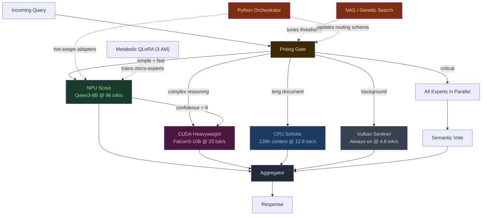

# Frankenswarm Architecture: Heterogeneous Hardware MoE

## The Thesis

> _"No esperes a tener el hardware perfecto. Conquista el hardware que tienes."_

Frankenswarm is a **physically-distributed Mixture of Experts** that treats every accelerator in the host machine as a specialized inference node. Instead of running N tiny models inside one GPU, we run N models across **every available silicon**: discrete GPU, integrated GPU, CPU, and Neural Processing Unit — each one an expert with different strengths, speeds, and energy costs.

The router doesn't just decide _what_ expert answers. It decides _where_ the computation happens.

## The Hardware Topology (Measured — 2026-05-22)

```
┌─────────────────────────────────────────────────────────────────────┐
│                 STRIX POINT — PHYSICAL MoE MAP                      │
│                                                                     │
│  ┌──────────────┐   ┌──────────────┐   ┌───────────┐   ┌────────┐ │
│  │  RTX 5070    │   │ Radeon 880M  │   │ Ryzen AI  │   │ XDNA2  │ │
│  │  (CUDA)      │   │ (Vulkan)     │   │ (CPU)     │   │ (NPU)  │ │
│  │              │   │              │   │           │   │        │ │
│  │  8GB GDDR7   │   │ Shared DDR5  │   │ 32GB DDR5 │   │ 50 TOPS│ │
│  │  23 tok/s    │   │ 4.8 tok/s    │   │ 12.8 tok/s│   │ 96 t/s │ │
│  │  ~80W        │   │ ~15W         │   │ ~45W      │   │ ~2W    │ │
│  │              │   │              │   │           │   │        │ │
│  │  ROLE:       │   │  ROLE:       │   │  ROLE:    │   │ ROLE:  │ │
│  │  Heavy       │   │  Sentinel    │   │  Bulk     │   │ Scout  │ │
│  │  Reasoning   │   │  Always-On   │   │  Context  │   │ Fast   │ │
│  │  10B models  │   │  Background  │   │  128K ctx │   │ Triage │ │
│  └──────┬───────┘   └──────┬───────┘   └─────┬─────┘   └───┬────┘ │
│         │                  │                 │              │      │
│         └──────────────────┼─────────────────┼──────────────┘      │
│                            ▼                 ▼                     │
│                    ┌───────────────┐  ┌─────────────┐              │
│                    │ Prolog Router │  │  Aggregator  │              │
│                    │ (The Oracle)  │  │  (Consensus) │              │
│                    └───────────────┘  └─────────────┘              │
└─────────────────────────────────────────────────────────────────────┘
```

## Core Pillars (Evolved)

### 1. Silicon Diversity as a Feature, Not a Constraint

Classical MoE assumes homogeneous compute. Every expert runs on the same hardware class. Frankenswarm **inverts** this: heterogeneity is the architecture. Each accelerator has a natural personality:

| Silicon           | Personality     | Natural Tasks                                               | Energy  | Latency   |
| ----------------- | --------------- | ----------------------------------------------------------- | ------- | --------- |
| **CUDA (dGPU)**   | The Heavyweight | Complex reasoning, code generation, multi-step planning     | High    | Low       |
| **CPU**           | The Scholar     | Massive context windows (128K+), long-document analysis     | Medium  | Medium    |
| **Vulkan (iGPU)** | The Sentinel    | Background monitoring, always-on health checks              | Low     | High      |
| **NPU (XDNA2)**   | The Scout       | Fast triage, classification, simple Q&A, sleep distillation | Minimal | Ultra-Low |

### 2. The Prolog Gate — Intent-Aware Routing

The Prolog router classifies the incoming query and maps it to the optimal hardware:

```prolog
% Hardware-aware routing rules
route(Query, npu)   :- is_simple(Query), latency_critical(Query).
route(Query, cuda)  :- requires_reasoning(Query), context_len(Query, N), N < 8192.
route(Query, cpu)   :- context_len(Query, N), N > 16384.
route(Query, vulkan):- is_background(Query), not(latency_critical(Query)).

% Energy-aware fallback cascade
fallback(npu, cuda).
fallback(cuda, cpu).
fallback(cpu, vulkan).

% Consensus mode for high-stakes decisions
strategy(Query, consensus) :- is_critical(Query), requires_reasoning(Query).
strategy(Query, cascade)   :- not(is_critical(Query)).
strategy(Query, race)      :- latency_critical(Query), is_simple(Query).
```

### 3. Aggregation Strategies

The aggregator combines expert outputs based on the routing strategy:

| Strategy      | Description                                                   | When                             |
| ------------- | ------------------------------------------------------------- | -------------------------------- |
| **Route**     | Single expert responds. Fastest.                              | Default for clear-domain queries |
| **Cascade**   | NPU answers first. If confidence < θ, escalate to CUDA.       | Most common — energy-optimal     |
| **Race**      | All available experts start in parallel. First response wins. | Latency-critical, simple queries |
| **Consensus** | All experts respond. Semantic vote picks the winner.          | Critical decisions, code review  |

### 4. BitNet Substrate (Preserved)

The original BitNet thesis remains valid — but repositioned:

- **Ternary weights** (`{-1, 0, 1}`) are ideal for NPU and CPU where FP16 throughput is limited
- **NEAT evolution** breeds specialized micro-topologies ($10\text{K}-100\text{K}$ params) that run on the NPU at 96 tok/s
- **Net2Net expansion** grows experts structurally without losing learned knowledge
- **Gradient refinement (QLoRA/Backprop)** scales these networks up to the 7M parameter threshold
- **The Heavyweight models** on CUDA don't need to be ternary — they use standard GGUF/INT4 quantization

This creates a **dual-tier system**:

- **Tier 1 (Hybrid Evolved)**: BitNet micro-experts evolved via NEAT and optimized via gradients up to 7M parameters, deployed on NPU/CPU
- **Tier 2 (Pre-trained)**: Foundation models (Qwen3, Falcon3, LLaMA) deployed on CUDA/Vulkan

### 5. TurboQuant KV Cache (Preserved)

With 4 accelerators maintaining independent KV caches, memory pressure multiplies. TurboQuant (3-bit QJL compression) becomes even more critical:

- Compress shared context to ~20% of FP16 size
- Enable cross-expert context handoff without recomputation
- Allow the CPU expert to hold 128K+ token contexts in DDR5

### 6. The Python Orchestrator & Dynamic PEFT Management

> _"Why rebuild the compiler when you can hot-swap the weights? Direct hardware execution beats runtime abstraction."_

This is the core engine that manages the active topology dynamically, replacing theoretical compilation chains with a pragmatic, high-performance execution flow.

#### The Core Insight: Dynamic Graph Assembly

Instead of a custom Lisp REPL that re-compiles topologies on the fly, Frankenswarm v2 uses **Python Orchestration** to swap **LoRA/QLoRA adapters** dynamically over frozen shared base models. The orchestrator represents the active swarm configuration as a standard JSON schema, updating the runtime graphs on standard acceleration frameworks (ONNX Runtime, llama.cpp, vLLM) in milliseconds.

This means:

- The base models (e.g., Qwen-1.5B, TinyLlama) are loaded once into hardware memory (NPU/iGPU).
- The routing policy is managed via Prolog/Python mappings.
- Specific domain experts are represented as lightweight **PEFT adapter weights** (~10MB–100MB) that are hot-swapped dynamically into the active context without restarting the inference server.

#### What This Looks Like in Practice

```python
# Dynamic Adapter Swapping & Routing Flow
class SwarmOrchestrator:
	def __init__(self, base_model_path: str):
		self.base_model = self._load_base_model(base_model_path)
		self.active_adapters = {}

	def hot_swap_adapter(self, expert_id: str, adapter_path: str):
		"""Loads a domain-specific LoRA adapter dynamically at runtime."""
		if expert_id in self.active_adapters:
			self.unload_adapter(expert_id)
		self.load_lora_weights(expert_id, adapter_path)
		self.active_adapters[expert_id] = adapter_path

	def route_and_execute(self, query: str):
		# Fast intent triage
		intent, confidence = prolog_gate.classify(query)
		if confidence > 0.85:
			# NPU Scout execution via active expert
			return self.execute_npu(intent, query)
		else:
			# Escalate cascade to heavy CUDA model
			return self.execute_cuda(query)
```

#### The Three Adaptation Loops

Frankenswarm operates on three distinct feedback loops at different timescales:

```
┌─────────────────────────────────────────────────────────────┐
│               THE THREE ADAPTATION LOOPS                    │
├────────────┬──────────────┬──────────────────────────────────┤
│   Loop     │  Timescale   │  What Adapts                     │
├────────────┼──────────────┼──────────────────────────────────┤
│ FAST       │ Per-query    │ Routing decisions                │
│ (Prolog)   │ ~200ms       │ Which accelerator handles the task│
├────────────┼──────────────┼──────────────────────────────────┤
│ MEDIUM     │ Per-session  │ Activation thresholds            │
│ (Orch.)    │ ~minutes     │ Confidence boundaries (θ)        │
├────────────┼──────────────┼──────────────────────────────────┤
│ SLOW       │ Per-sleep    │ Micro-expert weights & routing   │
│ (Metabolic)│ ~hours       │ PopuLoRA Asymmetric Self-Play   │
│            │              │ and weight-space SVD crossovers  │
└────────────┴──────────────┴──────────────────────────────────┘
```

- **FAST loop**: The Prolog Gate evaluates routing rules and dispatch metrics, assigning queries to the most cost-efficient accelerator.
- **MEDIUM loop**: The Orchestrator adjusts the classification confidence thresholds (θ) based on user interaction feedback to reduce latency overhead.
- **SLOW loop**: During the 3 AM sleep cycle, the system runs a **PopuLoRA asymmetric self-play session** overnight: GPU-bound models (Teacher role) generate frontier-difficulty tasks while NPU/iGPU/CPU-bound micro-experts (Student role) attempt them. Weak adapters are replaced using low-rank weight crossovers (SVD rotations, module swaps) to keep the curriculum actively moving.

#### Why Python + GGUF/ONNX?

Custom compiled environments add friction. By sticking to Python and standard serialization formats:

- **Native Hardware Access**: ONNX Runtime and llama.cpp provide direct, optimized execution paths for CUDA, ROCm, Vulkan, and NPU (XDNA2) without custom compilation overhead.
- **No Compilation Barrier**: Dynamic PEFT loading allows adapter hot-swapping theoretically in $<10\text{ms}$ without interrupting active inference streams. _(Note: Empirical practice will dictate if we need an L1 RAM cache for the most frequently used expert adapters, should the NPU memory bus bottleneck the physical hot-swap latency)._
- **Interoperability**: Direct integration with the Hugging Face and PyTorch ecosystems allows us to leverage state-of-the-art distillation and quantization tools out of the box.

#### The Hybrid Evolutionary Strategy

Evolving model weights for parameters scaling towards 7M is mathematically impractical due to the Curse of Dimensionality. Genetic algorithms suffer from evolutionary noise and stagnation at scale. Frankenswarm resolves this via a hybrid model:

1. **Seed Phase (NEAT)**: Genetically breed micro-topologies ($10\text{K}-100\text{K}$ parameters) for basic logic gates and classification tasks where low dimensionality makes genetic search highly efficient.
2. **Growth Phase (Net2Net)**: Expand the micro-expert architectures structurally using Net2Net expansion without losing learned functions.
3. **Consolidation Phase (PEFT/PopuLoRA)**: Once the network scales beyond $100\text{K}$ parameters towards the 7M threshold, we transition to gradient-based learning combined with **PopuLoRA asymmetric self-play**. GPU-bound teachers and NPU-bound students engage in a co-evolutionary arms race, using low-rank crossovers on LoRA tensors to retain parent capabilities.

## The Lifecycle (Evolved)



## The Difference

|           | Classical LLM       | Original Frankenswarm (v1) | Frankenswarm v2 (Distributed)            |
| --------- | ------------------- | -------------------------- | ---------------------------------------- |
| Hardware  | 1 GPU               | 1 GPU                      | **All available silicon**                |
| Experts   | 1 monolithic model  | N × 7M BitNet in VRAM      | **N models across 4 accelerators**       |
| Routing   | None (single model) | Prolog on embeddings       | **Prolog on intent + hardware affinity** |
| Energy    | Fixed (~250W)       | Fixed (~80W on GPU)        | **2W–80W adaptive**                      |
| Scaling   | Bigger GPU          | More micro-experts         | **More accelerator types**               |
| Evolution | Retraining          | NEAT + Net2Net             | **NAS + QLoRA + Net2Net growth**         |
| Latency   | Fixed               | Variable (swap overhead)   | **Cascade: 200ms (NPU) → 2s (CUDA)**     |

## Integration with Red-Pill

Frankenswarm is not a standalone system. It plugs directly into the Red-Pill Bünker via the existing `ProviderRegistry`:

```python
# Already implemented (2026-05-22)
ProviderRegistry.get_inference_provider("npu")   # FastFlowLMInferenceProvider
ProviderRegistry.get_inference_provider("sip")   # SipInferenceProvider (CUDA/CPU)
ProviderRegistry.get_inference_provider("bitnet") # BitNetInferenceProvider

# The Frankenswarm Router replaces the simple InferenceRouter
# with Prolog-based intent classification + hardware affinity
```

The `InferenceRouter` in `red_pill/swarm/routing.py` already supports tiers: `npu`, `local_first`, `ternary`, `cheap`. Frankenswarm evolves this from a static priority list to a **dynamic, learned routing policy**.

## Energy Budget — The Silent Revolution

The most transgressive aspect of Frankenswarm v2 is not speed — it's **energy sovereignty**.

A cloud API call to GPT-4 consumes an estimated 0.001–0.01 kWh per request. That's invisible to the user, but real. Over a year of heavy use, it's ~100+ kWh of someone else's electricity, on someone else's hardware, with someone else's rules.

Frankenswarm's cascade strategy means:

- **80% of queries** are handled by the NPU at 2W → 0.000006 kWh/request
- **15% of queries** escalate to CUDA at 80W → 0.0002 kWh/request
- **5% of queries** go to consensus (all 4) → 0.0004 kWh/request

**Weighted average: ~0.00005 kWh/request. That's 200x more efficient than cloud.**

Not because we're smarter than Google's datacenters. Because we don't answer every question with a 400B model. We answer most questions with 2 watts.

That's sovereignty. Not just of data — of _energy_.

---

## The Two-Phase Strategy: PoC → Arena

Frankenswarm's development is split into two fundamentally different phases. The first validates the infrastructure. The second breeds the intelligence.

### Phase A: Proof of Concept (Existing Models)

> _"Don't build the engine and the fuel at the same time."_

Before training any custom model from scratch, we validate the entire distributed MoE infrastructure using **pre-existing models**:

- **NPU**: Qwen3-0.6B / Qwen3-8B via FastFlowLM (already running)
- **CUDA**: Falcon3-10B-1.58b via BitNet / llama.cpp (already benchmarked)
- **CPU**: Falcon3-10B via build_vulkan (already benchmarked)
- **Vulkan iGPU**: Falcon3-10B via Vulkan backend (already benchmarked)

What we validate in this phase:

- [x] Can we serve inference on all 4 silicon types simultaneously?
- [ ] Can the Prolog Gate route queries to the right accelerator?
- [ ] Can the Aggregator merge/vote on multi-expert responses?
- [ ] Can Cascade escalation (NPU → CUDA) work reliably?
- [ ] Is the energy savings hypothesis real in practice (80% NPU)?
- [ ] Can the Python orchestrator hot-swap adapters on the NPU?

**No training. No NEAT. No custom models.** Just plumbing, routing, and aggregation. If this works, the thesis is proven: heterogeneous hardware MoE is viable on consumer silicon.

### Phase B: The Arena (Custom-Bred Experts)

> _"Now we build the creatures that live in the machine."_

Once the infrastructure is validated, we enter the Arena: training custom BitNet micro-experts from scratch, with a novel **three-layer architecture** designed for independent evolution.

---

## The Three-Layer Expert Architecture

Every expert in the Arena is designed as a **four-layer sovereign architecture** compiled and executed directly as a single hardware graph. All custom experts in the swarm share the same internal tokenized vocabulary (the Base language), enabling high-speed, noise-free local execution:

```
┌─────────────────────────────────────────────────────────────┐
│              FOUR-LAYER SOVEREIGN ANATOMY                   │
│                                                             │
│  ┌─────────────────────────────────────────────────────┐    │
│  │          LAYER 1: THE SOVEREIGN BASE                │    │
│  │                                                     │    │
│  │  Shared discrete Token Vocabulary (e.g., 8K dense    │    │
│  │  tokens optimized for logic, code, and agent states).│    │
│  │  This is the universal discrete interface of the    │    │
│  │  entire internal swarm.                             │    │
│  │                                                     │    │
│  │  • Frozen, static vocab token mapping               │    │
│  │  • Defines the common discrete tongue of all nodes  │    │
│  └──────────────────────┬──────────────────────────────┘    │
│                         │ (Token ID - 2 bytes)              │
│  ┌──────────────────────▼──────────────────────────────┐    │
│  │          LAYER 2: INBOUND TRANSLATOR ($W_E$)        │    │
│  │                                                     │    │
│  │  Embedding layer mapping the shared token IDs into  │    │
│  │  the expert's specific continuous hidden space.     │    │
│  │                                                     │    │
│  │  • Lightweight projection matrix                    │    │
│  │  • Re-trained/adjusted when Layer 3 mutates         │    │
│  └──────────────────────┬──────────────────────────────┘    │
│                         │ (Expert Latent Space)             │
│  ┌──────────────────────▼──────────────────────────────┐    │
│  │          LAYER 3: SPECIALIST CORE (Core)            │    │
│  │                                                     │    │
│  │  Ternary BitNet layers `{-1, 0, 1}` containing      │    │
│  │  specialized domain logic and learned patterns.     │    │
│  │                                                     │    │
│  │  • Seeded via NEAT ($10\text{K}-100\text{K}$ params) │    │
│  │  • Grown structurally using Net2Net expansion       │    │
│  │  • Refined via backpropagation/QLoRA up to 7M params│    │
│  └──────────────────────┬──────────────────────────────┘    │
│                         │ (Expert Latent Space)             │
│  ┌──────────────────────▼──────────────────────────────┐    │
│  │    LAYER 4: OUTBOUND TRANSLATOR ($W_{LM\_Head}$)    │    │
│  │                                                     │    │
│  │  Language Model Head mapping the internal expert    │    │
│  │  features back into the shared Base Token IDs.       │    │
│  │                                                     │    │
│  │  • Lightweight projection matrix                    │    │
│  │  • Re-aligned to Layer 1 vocabulary after mutations  │    │
│  └─────────────────────────────────────────────────────┘    │
└─────────────────────────────────────────────────────────────┘
```

### Why Four Layers?

The 4-layer design solves the structural and physical bottlenecks of multi-expert systems:

- **Catastrophic Forgetting & Drift Isolation**: If the **Specialist Core (Layer 3)** mutates or changes its internal hidden dimensions, we do not need to re-train the other experts. We simply freeze Layer 3 and re-train the **Inbound Translator (Layer 2)** and **Outbound Translator (Layer 4)**. This re-aligns the mutated expert to the shared **Sovereign Base (Layer 1)**, keeping the rest of the swarm untouched.
- **Zero I/O PCIE Bottleneck**: When Expert A routes its output to Expert B, it sends Token IDs (only 2 bytes per token) over the hardware bus, bypassing the 384x memory bloat of continuous float vectors.
- **Noise Reset (Quantization)**: Projecting the continuous output back to discrete Token IDs at Layer 4 acts as a low-pass filter, resetting the representation noise to zero at each step and preventing latent space drift.

| Layer                   |      Shared?      |           Adaptation Speed           | What Adapts                                        |
| ----------------------- | :---------------: | :----------------------------------: | -------------------------------------------------- |
| **Base (Vocab)**        | Yes — all experts |           Frozen (static)            | The shared discrete token vocabulary configuration |
| **Inbound ($W_E$)**     |  No — per expert  |       Rapid (LoRA/projection)        | Embedding projection aligned to the common vocab   |
| **Specialist Core**     |  No — per expert  | Hybrid (NEAT $\rightarrow$ Backprop) | Internal ternary weight topologies & logic         |
| **Outbound ($W_{LM}$)** |  No — per expert  |       Rapid (LoRA/projection)        | LM Head projection aligned to the common vocab     |

### The Lifecycle of an Expert Upgrade


---

## Hardware Execution & Swarm Routing

> _"The NPU executes the entire 4-layer graph locally, while Prolog directs the traffic at the boundaries."_

### 1. Local NPU Execution (No Runtime Hacking)

Rather than hacking low-level C++ engines like `llama.cpp` to expose and route continuous activations, each custom expert's 4 layers are compiled as a **single, unified ONNX computational graph** executed locally on the NPU (via ONNX Runtime with the Ryzen AI Execution Provider).

- The input is a sequence of shared Token IDs.
- The NPU performs the forward pass: `Embedding (L2) ──► BitNet Core (L3) ──► LM Head (L4)`.
- The output is a sequence of shared Token IDs.
- The host system reads and routes these Token IDs with minimal memory bandwidth.

### 2. Integration with External Models (GGUF Codecs)

If the swarm needs to call an external commercial model (e.g. a Llama-70B running on CUDA), we treat it as a black box and wrap it in a **Boundary Translation Codec (Traductor Inverso)**:

- **Input path**: The codec takes our sovereign Token IDs, decodes them to raw UTF-8 text, and tokenizes the text using the external model's proprietary tokenizer.
- **Output path**: The codec decodes the external model's output tokens back to raw UTF-8 text, and tokenizes it using our sovereign Tokenizer back into Capa 1 Token IDs.
- Using UTF-8 text as the translation boundary eliminates token-alignment errors and ensures 100% compatibility with any model.

### 3. The Chained Inference Protocol (Example)

For a chained query like `(2+2) / 3`:

1. The **Prolog Gate** parses the execution graph and routes the query metadata.
2. **Expert A (Addition)** executes: receives `[VAL_2, ADD, VAL_2]` in sovereign tokens, processes it, and generates `[VAL_4]` in sovereign tokens.
3. The orchestrator routes the token list `[VAL_4]` and the remainder `/ 3` directly into **Expert B (Division)**.
4. **Expert B (Division)** processes `[VAL_4, DIV, VAL_3]` and outputs `[VAL_1_33]` in sovereign tokens.
5. The boundary decoder translates `[VAL_1_33]` into the human-readable text `"1.33"`.

```
  Human     ┌───────────┐     ┌────────────────────────────────────────┐     ┌───────────┐     Human
  Input ──► │ BOUNDARY  │ ──► │            THE SWARM                    │ ──► │ BOUNDARY  │ ──► Output
  (Text)    │  CODEC    │     │                                        │     │  CODEC    │     (Text)
            │ (Encoder) │     │  ┌────────┐  ┌────────┐  ┌────────┐   │     │ (Decoder) │
            └───────────┘     │  │Expert A│  │Expert B│  │Expert C│   │     └───────────┘
                              │  │┌──────┐│  │┌──────┐│  │┌──────┐│   │
                              │  ││Vocab ││  ││Vocab ││  ││Vocab ││   │  ← Capa 1: Shared Base (Sovereign Vocab)
                              │  │├──────┤│  │├──────┤│  │├──────┤│   │
                              │  ││Embed ││  ││Embed ││  ││Embed ││   │  ← Capa 2: Inbound ($W_E$)
                              │  │├──────┤│  │├──────┤│  │├──────┤│   │
                              │  ││Core  ││  ││Core  ││  ││Core  ││   │  ← Capa 3: Specialist Core (Ternary)
                              │  │├──────┤│  │├──────┤│  │├──────┤│   │
                              │  ││Head  ││  ││Head  ││  ││Head  ││   │  ← Capa 4: Outbound ($W_{LM}$)
                              │  │└──────┘│  │└──────┘│  │└──────┘│   │
                              │  └────────┘  └────────┘  └────────┘   │
                              │        ▲          ▲          ▲        │
                              │        └──────────┼──────────┘        │
                              │            Sovereign Tokens           │
                              │       (2 bytes, discrete, clean)      │
                              └────────────────────────────────────────┘
```
