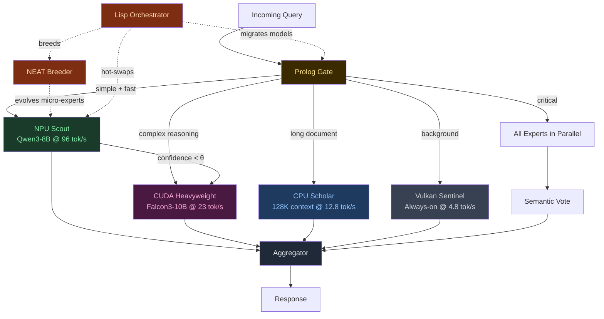

# Frankenswarm Architecture: Heterogeneous Hardware MoE

## The Thesis

> *"No esperes a tener el hardware perfecto. Conquista el hardware que tienes."*

Frankenswarm is a **physically-distributed Mixture of Experts** that treats every accelerator in the host machine as a specialized inference node. Instead of running N tiny models inside one GPU, we run N models across **every available silicon**: discrete GPU, integrated GPU, CPU, and Neural Processing Unit — each one an expert with different strengths, speeds, and energy costs.

The router doesn't just decide *what* expert answers. It decides *where* the computation happens.

## The Hardware Topology (Measured — 2026-05-22)

```
┌─────────────────────────────────────────────────────────────────────┐
│                 STRIX POINT — PHYSICAL MoE MAP                      │
│                                                                     │
│  ┌──────────────┐   ┌──────────────┐   ┌───────────┐   ┌────────┐ │
│  │  RTX 5070    │   │ Radeon 880M  │   │ Ryzen AI  │   │ XDNA2  │ │
│  │  (CUDA)      │   │ (Vulkan)     │   │ (CPU)     │   │ (NPU)  │ │
│  │              │   │              │   │           │   │        │ │
│  │  8GB GDDR7   │   │ Shared DDR5  │   │ 32GB DDR5 │   │ 50 TOPS│ │
│  │  23 tok/s    │   │ 4.8 tok/s    │   │ 12.8 tok/s│   │ 96 t/s │ │
│  │  ~80W        │   │ ~15W         │   │ ~45W      │   │ ~2W    │ │
│  │              │   │              │   │           │   │        │ │
│  │  ROLE:       │   │  ROLE:       │   │  ROLE:    │   │ ROLE:  │ │
│  │  Heavy       │   │  Sentinel    │   │  Bulk     │   │ Scout  │ │
│  │  Reasoning   │   │  Always-On   │   │  Context  │   │ Fast   │ │
│  │  10B models  │   │  Background  │   │  128K ctx │   │ Triage │ │
│  └──────┬───────┘   └──────┬───────┘   └─────┬─────┘   └───┬────┘ │
│         │                  │                 │              │      │
│         └──────────────────┼─────────────────┼──────────────┘      │
│                            ▼                 ▼                     │
│                    ┌───────────────┐  ┌─────────────┐              │
│                    │ Prolog Router │  │  Aggregator  │              │
│                    │ (The Oracle)  │  │  (Consensus) │              │
│                    └───────────────┘  └─────────────┘              │
└─────────────────────────────────────────────────────────────────────┘
```

## Core Pillars (Evolved)

### 1. Silicon Diversity as a Feature, Not a Constraint

Classical MoE assumes homogeneous compute. Every expert runs on the same hardware class. Frankenswarm **inverts** this: heterogeneity is the architecture. Each accelerator has a natural personality:

| Silicon | Personality | Natural Tasks | Energy | Latency |
|---------|-------------|---------------|--------|---------|
| **CUDA (dGPU)** | The Heavyweight | Complex reasoning, code generation, multi-step planning | High | Low |
| **CPU** | The Scholar | Massive context windows (128K+), long-document analysis | Medium | Medium |
| **Vulkan (iGPU)** | The Sentinel | Background monitoring, always-on health checks | Low | High |
| **NPU (XDNA2)** | The Scout | Fast triage, classification, simple Q&A, sleep distillation | Minimal | Ultra-Low |

### 2. The Prolog Gate — Intent-Aware Routing

The Prolog router classifies the incoming query and maps it to the optimal hardware:

```prolog
% Hardware-aware routing rules
route(Query, npu)   :- is_simple(Query), latency_critical(Query).
route(Query, cuda)  :- requires_reasoning(Query), context_len(Query, N), N < 8192.
route(Query, cpu)   :- context_len(Query, N), N > 16384.
route(Query, vulkan):- is_background(Query), not(latency_critical(Query)).

% Energy-aware fallback cascade
fallback(npu, cuda).
fallback(cuda, cpu).
fallback(cpu, vulkan).

% Consensus mode for high-stakes decisions
strategy(Query, consensus) :- is_critical(Query), requires_reasoning(Query).
strategy(Query, cascade)   :- not(is_critical(Query)).
strategy(Query, race)      :- latency_critical(Query), is_simple(Query).
```

### 3. Aggregation Strategies

The aggregator combines expert outputs based on the routing strategy:

| Strategy | Description | When |
|----------|-------------|------|
| **Route** | Single expert responds. Fastest. | Default for clear-domain queries |
| **Cascade** | NPU answers first. If confidence < θ, escalate to CUDA. | Most common — energy-optimal |
| **Race** | All available experts start in parallel. First response wins. | Latency-critical, simple queries |
| **Consensus** | All experts respond. Semantic vote picks the winner. | Critical decisions, code review |

### 4. BitNet Substrate (Preserved)

The original BitNet thesis remains valid — but repositioned:
- **Ternary weights** (`{-1, 0, 1}`) are ideal for NPU and CPU where FP16 throughput is limited
- **NEAT evolution** can breed specialized micro-experts (7M params) that run on the NPU at 96 tok/s
- **Net2Net expansion** grows experts that plateau without losing knowledge
- **The Heavyweight models** on CUDA don't need to be ternary — they use standard GGUF/INT4 quantization

This creates a **dual-tier system**:
- **Tier 1 (Evolved)**: BitNet micro-experts bred via NEAT, deployed on NPU/CPU
- **Tier 2 (Pre-trained)**: Foundation models (Qwen3, Falcon3, LLaMA) deployed on CUDA/Vulkan

### 5. TurboQuant KV Cache (Preserved)

With 4 accelerators maintaining independent KV caches, memory pressure multiplies. TurboQuant (3-bit QJL compression) becomes even more critical:
- Compress shared context to ~20% of FP16 size
- Enable cross-expert context handoff without recomputation
- Allow the CPU expert to hold 128K+ token contexts in DDR5

### 6. The Lisp Metaprogrammer — The Game Changer

> *"Code is data. Data is code. The network is a program that rewrites itself."*

This is the pillar that turns Frankenswarm from an inference system into a **living organism**.

#### The Core Insight: Homoiconicity

Lisp is the only family of languages where **the code and the data share the same structure** (S-expressions). A neural network topology — its layers, connections, weights — can be represented as a nested list. And in Lisp, nested lists *are* the program.

This means:
- A BitNet expert's architecture is a **Lisp expression**
- The NEAT mutator is a **Lisp function that rewrites Lisp expressions**
- The routing policy is a **Lisp expression that the system can modify about itself**

The network doesn't just *run*. It **reads itself, modifies itself, and continues running** — without stopping, without recompiling, without losing state.

#### What This Looks Like in Practice

```lisp
;; A BitNet expert is just data
(defvar *expert-alpha*
  '(:name "code-specialist"
    :silicon :npu
    :layers ((linear :in 384 :out 512 :weights :ternary)
             (attention :heads 4 :dim 128)
             (linear :in 512 :out 384 :weights :ternary))
    :fitness 0.73
    :generation 14))

;; NEAT mutation: add a layer — just list manipulation
(defun mutate-add-layer (expert)
  (let ((layers (getf expert :layers))
        (new-layer '(linear :in 512 :out 512 :weights :ternary)))
    (setf (getf expert :layers)
          (insert-after layers 1 new-layer))
    (setf (getf expert :generation)
          (1+ (getf expert :generation)))
    expert))

;; Net2Net expansion: grow a layer's width — the network keeps its memory
(defun net2net-expand (expert layer-idx new-width)
  (let* ((layer (nth layer-idx (getf expert :layers)))
         (old-width (getf layer :out)))
    ;; Zero-pad: new neurons start at 0 (identity in BitNet)
    (setf (getf layer :out) new-width)
    ;; The network is STILL RUNNING while we do this
    (hot-reload-weights expert layer-idx
                        :pad-strategy :zero
                        :old-width old-width)))

;; The routing policy is ALSO code the system can rewrite
(defvar *routing-policy*
  '(lambda (query)
     (cond
       ((simple-p query)        :npu)
       ((reasoning-p query)     :cuda)
       ((long-context-p query)  :cpu)
       (t                       :vulkan))))

;; After observing that NPU handles 60% of "reasoning" queries fine:
;; The system REWRITES ITS OWN ROUTING POLICY
(defun evolve-routing (observations)
  (when (> (npu-success-rate observations :reasoning) 0.6)
    (setf *routing-policy*
          '(lambda (query)
             (cond
               ((simple-p query)        :npu)
               ((and (reasoning-p query)
                     (< (complexity query) 0.7))  :npu)  ;; NEW RULE
               ((reasoning-p query)     :cuda)
               ((long-context-p query)  :cpu)
               (t                       :vulkan))))))
```

#### The Three Loops of Self-Modification

Frankenswarm doesn't have one feedback loop — it has three, running at different timescales:

```
┌─────────────────────────────────────────────────────────────┐
│               THE THREE EVOLUTIONARY LOOPS                   │
├────────────┬──────────────┬──────────────────────────────────┤
│   Loop     │  Timescale   │  What Mutates                    │
├────────────┼──────────────┼──────────────────────────────────┤
│ FAST       │ Per-query    │ Routing policy                   │
│ (Prolog)   │ ~200ms       │ Which silicon handles what       │
├────────────┼──────────────┼──────────────────────────────────┤
│ MEDIUM     │ Per-session  │ Expert weights                   │
│ (NEAT)     │ ~minutes     │ BitNet ternary mutations         │
├────────────┼──────────────┼──────────────────────────────────┤
│ SLOW       │ Per-sleep    │ Network topology + hardware map  │
│ (Lisp)     │ ~hours       │ Add/remove layers, migrate       │
│            │              │ experts between accelerators     │
└────────────┴──────────────┴──────────────────────────────────┘
```

**FAST loop**: Prolog observes which expert answered correctly and adjusts routing weights. If the NPU keeps nailing "reasoning" queries, Prolog stops sending them to CUDA. This happens *between queries*.

**MEDIUM loop**: NEAT evaluates fitness of BitNet micro-experts after N queries. The worst die. The best reproduce with mutated ternary weights. This happens during idle time or low-priority windows.

**SLOW loop**: The Lisp orchestrator — the deepest layer — restructures the entire topology. It adds layers via Net2Net, migrates experts from NPU to CPU if they've grown too large, breeds entirely new specialists, and **rewrites the routing policy itself**. This happens during the Red-Pill sleep cycle (3 AM metabolic window).

#### Why Not Just Python?

Python can do metaprogramming via `exec()`, `ast.parse()`, or metaclasses. But it's **bolted on** — the language wasn't designed for it. You're fighting the runtime.

Lisp was **born** for this:
- **No compilation barrier**: `eval` runs modified code instantly
- **Macros are first-class**: You can write code that writes code that writes code
- **REPL-native**: The entire system is a live, modifiable session
- **Garbage-collected mutation**: Dead topologies are reclaimed automatically
- **Serialization is free**: An S-expression IS its own serialization format

The practical implication: at 3 AM, during the sleep cycle, the Lisp orchestrator can:
1. Read the day's fitness logs
2. Identify underperforming experts
3. Expand their layers with Net2Net (zero-pad)
4. Spawn a NEAT population from the expanded topology
5. Evaluate the population on cached queries
6. Deploy the winner to the NPU
7. Update the routing policy to give the new expert more traffic
8. **All without stopping a single inference server**

This is not optimization. This is **evolution**. The system you go to sleep with is not the system you wake up to.

#### The Convergence: Lisp + NEAT + NPU

Here's where it gets truly transgressive:

The NPU runs BitNet at 96 tok/s for 0.6B models. A NEAT-evolved micro-expert of 1-7M parameters would run at **thousands of tok/s** on the NPU. That means the NEAT fitness evaluation loop — which normally takes hours on a GPU — can run **in real-time on the NPU while the GPU does actual work**.

```
     GPU (CUDA)                    NPU (XDNA2)
     ┌──────────┐                 ┌──────────────┐
     │ Serving   │                │ NEAT Loop     │
     │ Falcon-10B│                │               │
     │ to user   │                │ Population:   │
     │           │    ◄────────── │ 100 BitNet    │
     │ (23 t/s)  │   deploy      │ micro-experts │
     │           │   winner      │ evaluating    │
     └──────────┘                │ at 1000+ t/s  │
                                 │               │
                                 │ Lisp REPL     │
                                 │ mutating      │
                                 │ topologies    │
                                 └──────────────┘
```

The GPU serves. The NPU evolves. In parallel. At 2 watts.

**The system is literally growing new neurons while answering your questions.**


## The Lifecycle (Evolved)



## The Difference

| | Classical LLM | Original Frankenswarm (v1) | Frankenswarm v2 (Distributed) |
|---|---|---|---|
| Hardware | 1 GPU | 1 GPU | **All available silicon** |
| Experts | 1 monolithic model | N × 7M BitNet in VRAM | **N models across 4 accelerators** |
| Routing | None (single model) | Prolog on embeddings | **Prolog on intent + hardware affinity** |
| Energy | Fixed (~250W) | Fixed (~80W on GPU) | **2W–80W adaptive** |
| Scaling | Bigger GPU | More micro-experts | **More accelerator types** |
| Evolution | Retraining | NEAT + Net2Net | **NEAT + Net2Net + hardware migration** |
| Latency | Fixed | Variable (swap overhead) | **Cascade: 200ms (NPU) → 2s (CUDA)** |

## Integration with Red-Pill

Frankenswarm is not a standalone system. It plugs directly into the Red-Pill Bünker via the existing `ProviderRegistry`:

```python
# Already implemented (2026-05-22)
ProviderRegistry.get_inference_provider("npu")   # FastFlowLMInferenceProvider
ProviderRegistry.get_inference_provider("sip")   # SipInferenceProvider (CUDA/CPU)
ProviderRegistry.get_inference_provider("bitnet") # BitNetInferenceProvider

# The Frankenswarm Router replaces the simple InferenceRouter
# with Prolog-based intent classification + hardware affinity
```

The `InferenceRouter` in `red_pill/swarm/routing.py` already supports tiers: `npu`, `local_first`, `ternary`, `cheap`. Frankenswarm evolves this from a static priority list to a **dynamic, learned routing policy**.

## Energy Budget — The Silent Revolution

The most transgressive aspect of Frankenswarm v2 is not speed — it's **energy sovereignty**.

A cloud API call to GPT-4 consumes an estimated 0.001–0.01 kWh per request. That's invisible to the user, but real. Over a year of heavy use, it's ~100+ kWh of someone else's electricity, on someone else's hardware, with someone else's rules.

Frankenswarm's cascade strategy means:
- **80% of queries** are handled by the NPU at 2W → 0.000006 kWh/request
- **15% of queries** escalate to CUDA at 80W → 0.0002 kWh/request
- **5% of queries** go to consensus (all 4) → 0.0004 kWh/request

**Weighted average: ~0.00005 kWh/request. That's 200x more efficient than cloud.**

Not because we're smarter than Google's datacenters. Because we don't answer every question with a 400B model. We answer most questions with 2 watts.

That's sovereignty. Not just of data — of *energy*.
