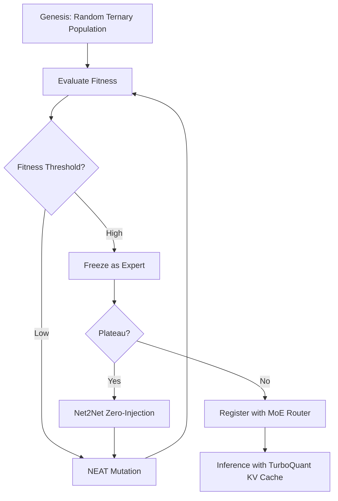

# Frankenswarm Architecture: Dynamic NeuroEvolution

## Objective
Frankenswarm is an experimental neural architecture aiming to solve the VRAM-bound constraints of LLM scaling by combining ternary weights, neuroevolution, dynamic capacity expansion, and highly compressed attention caches. 

The goal is to breed a **Swarm of Local Experts** that can run entirely within an 8GB VRAM envelope, evolving organically to adapt to new tasks without catastrophic forgetting or the need for massive backpropagation clusters.

## Core Pillars

1. **BitNet (1.58b) - The Substrate**
   - **Concept**: Neural weights are constrained to `{-1, 0, 1}`.
   - **Why**: Eliminates `FP16/FP32` matrix multiplications. Forward passes become simple additions and subtractions. Radically reduces the VRAM and compute footprint, enabling evolutionary algorithms to mutate weights at high speed.
   - **Reference**: *The Era of 1-bit LLMs: All Large Language Models are in 1.58 Bits* ([arXiv:2402.17764](https://arxiv.org/abs/2402.17764))

2. **NEAT (NeuroEvolution of Augmenting Topologies) - The Mutator**
   - **Concept**: Genetic algorithm that evolves both the weighting parameters and the structures of networks, attempting to find a balance between fitness and topological simplicity.
   - **Why**: Because BitNet weights are discrete, standard gradient-based optimizers (AdamW) struggle or require complex straight-through estimators. NEAT allows us to mutate `-1` to `1` directly based on heuristic fitness without needing differentiable loss landscapes.
   - **Reference**: *Evolving Neural Networks through Augmenting Topologies* (Stanley & Miikkulainen, 2002).

3. **Net2Net - The Expander**
   - **Concept**: A framework for accelerating learning by transferring knowledge from a smaller network to a larger one, preserving the function mapping perfectly via zero-padding.
   - **Why**: When a sub-network (Expert) plateaus in fitness, we use Net2Net to inject new "empty" neurons (initialized to `0`). The network retains all previous knowledge while acquiring new dimensionality for further NEAT mutation.
   - **Reference**: *Net2Net: Accelerating Learning via Knowledge Transfer* ([arXiv:1511.05641](https://arxiv.org/abs/1511.05641))

4. **MoE (Mixture of Experts) - The Router (Prolog)**
   - **Concept**: A sparse gating mechanism governed by an strict **Prolog Expert**. It selects a subset of experts based on deterministic logical constraints rather than mere probabilistic weights.
   - **Why**: As the population of BitNet mutants grows, they specialize and communicate via pure multidimensional embeddings. Prolog validates the logical sequence and routes tasks efficiently without hallucinations.
   - **Reference**: *Outrageously Large Neural Networks: The Sparsely-Gated Mixture-of-Experts Layer* ([arXiv:1701.06538](https://arxiv.org/abs/1701.06538))

5. **The Genetic Engineer - The Orchestrator (Lisp)**
   - **Concept**: A metaprogramming layer governed by a **Lisp Expert**. Treats the entire NEAT/Net2Net topologies as data structures (Homoiconicity).
   - **Why**: Allows the Frankenswarm to mutate, rewrite its own code, and inject Net2Net nodes at runtime without shutting down. Lisp orchestrates the evolutionary process.

6. **TurboQuant (QJL + PolarQuant) - The Compressor**
   - **Concept**: Aggressive KV Cache compression down to 2.5-3.5 bits using Quantized Johnson-Lindenstrauss projections while isolating outliers.
   - **Why**: The fatal bottleneck for MoE routing is VRAM exhaustion due to decentralized KV caches. TurboQuant shrinks the Attention State footprint by ~80%, allowing the Frankenswarm to route thousands of tokens across hundreds of experts without OOM.

## The Lifecycle

## Next Steps
- [ ] Establish PyTorch / NumPy prototype for 1-bit linear layers with dynamic shape manipulation (`torch.cat` padding).
- [ ] Implement the basic genetic loop (Selection, Crossover, Mutation of ternary matrices).
- [ ] Benchmark memory consumption of 100 mini-experts vs 1 monolithic model.
