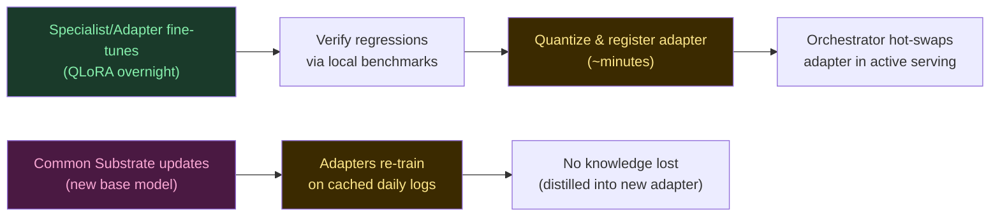

# Frankenswarm Architecture: Heterogeneous Hardware MoE

## The Thesis

> *"No esperes a tener el hardware perfecto. Conquista el hardware que tienes."*

Frankenswarm is a **physically-distributed Mixture of Experts** that treats every accelerator in the host machine as a specialized inference node. Instead of running N tiny models inside one GPU, we run N models across **every available silicon**: discrete GPU, integrated GPU, CPU, and Neural Processing Unit — each one an expert with different strengths, speeds, and energy costs.

The router doesn't just decide *what* expert answers. It decides *where* the computation happens.

## The Hardware Topology (Measured — 2026-05-22)

```
┌─────────────────────────────────────────────────────────────────────┐
│                 STRIX POINT — PHYSICAL MoE MAP                      │
│                                                                     │
│  ┌──────────────┐   ┌──────────────┐   ┌───────────┐   ┌────────┐ │
│  │  RTX 5070    │   │ Radeon 880M  │   │ Ryzen AI  │   │ XDNA2  │ │
│  │  (CUDA)      │   │ (Vulkan)     │   │ (CPU)     │   │ (NPU)  │ │
│  │              │   │              │   │           │   │        │ │
│  │  8GB GDDR7   │   │ Shared DDR5  │   │ 32GB DDR5 │   │ 50 TOPS│ │
│  │  23 tok/s    │   │ 4.8 tok/s    │   │ 12.8 tok/s│   │ 96 t/s │ │
│  │  ~80W        │   │ ~15W         │   │ ~45W      │   │ ~2W    │ │
│  │              │   │              │   │           │   │        │ │
│  │  ROLE:       │   │  ROLE:       │   │  ROLE:    │   │ ROLE:  │ │
│  │  Heavy       │   │  Sentinel    │   │  Bulk     │   │ Scout  │ │
│  │  Reasoning   │   │  Always-On   │   │  Context  │   │ Fast   │ │
│  │  10B models  │   │  Background  │   │  128K ctx │   │ Triage │ │
│  └──────┬───────┘   └──────┬───────┘   └─────┬─────┘   └───┬────┘ │
│         │                  │                 │              │      │
│         └──────────────────┼─────────────────┼──────────────┘      │
│                            ▼                 ▼                     │
│                    ┌───────────────┐  ┌─────────────┐              │
│                    │ Prolog Router │  │  Aggregator  │              │
│                    │ (The Oracle)  │  │  (Consensus) │              │
│                    └───────────────┘  └─────────────┘              │
└─────────────────────────────────────────────────────────────────────┘
```

## Core Pillars (Evolved)

### 1. Silicon Diversity as a Feature, Not a Constraint

Classical MoE assumes homogeneous compute. Every expert runs on the same hardware class. Frankenswarm **inverts** this: heterogeneity is the architecture. Each accelerator has a natural personality:

| Silicon | Personality | Natural Tasks | Energy | Latency |
|---------|-------------|---------------|--------|---------|
| **CUDA (dGPU)** | The Heavyweight | Complex reasoning, code generation, multi-step planning | High | Low |
| **CPU** | The Scholar | Massive context windows (128K+), long-document analysis | Medium | Medium |
| **Vulkan (iGPU)** | The Sentinel | Background monitoring, always-on health checks | Low | High |
| **NPU (XDNA2)** | The Scout | Fast triage, classification, simple Q&A, sleep distillation | Minimal | Ultra-Low |

### 2. The Prolog Gate — Intent-Aware Routing

The Prolog router classifies the incoming query and maps it to the optimal hardware:

```prolog
% Hardware-aware routing rules
route(Query, npu)   :- is_simple(Query), latency_critical(Query).
route(Query, cuda)  :- requires_reasoning(Query), context_len(Query, N), N < 8192.
route(Query, cpu)   :- context_len(Query, N), N > 16384.
route(Query, vulkan):- is_background(Query), not(latency_critical(Query)).

% Energy-aware fallback cascade
fallback(npu, cuda).
fallback(cuda, cpu).
fallback(cpu, vulkan).

% Consensus mode for high-stakes decisions
strategy(Query, consensus) :- is_critical(Query), requires_reasoning(Query).
strategy(Query, cascade)   :- not(is_critical(Query)).
strategy(Query, race)      :- latency_critical(Query), is_simple(Query).
```

### 3. Aggregation Strategies

The aggregator combines expert outputs based on the routing strategy:

| Strategy | Description | When |
|----------|-------------|------|
| **Route** | Single expert responds. Fastest. | Default for clear-domain queries |
| **Cascade** | NPU answers first. If confidence < θ, escalate to CUDA. | Most common — energy-optimal |
| **Race** | All available experts start in parallel. First response wins. | Latency-critical, simple queries |
| **Consensus** | All experts respond. Semantic vote picks the winner. | Critical decisions, code review |

### 4. BitNet Substrate (Preserved)

The original BitNet thesis remains valid — but repositioned:
- **Ternary weights** (`{-1, 0, 1}`) are ideal for NPU and CPU where FP16 throughput is limited
- **NEAT evolution** breeds specialized micro-topologies ($10\text{K}-100\text{K}$ params) that run on the NPU at 96 tok/s
- **Net2Net expansion** grows experts structurally without losing learned knowledge
- **Gradient refinement (QLoRA/Backprop)** scales these networks up to the 7M parameter threshold
- **The Heavyweight models** on CUDA don't need to be ternary — they use standard GGUF/INT4 quantization

This creates a **dual-tier system**:
- **Tier 1 (Hybrid Evolved)**: BitNet micro-experts evolved via NEAT and optimized via gradients up to 7M parameters, deployed on NPU/CPU
- **Tier 2 (Pre-trained)**: Foundation models (Qwen3, Falcon3, LLaMA) deployed on CUDA/Vulkan

### 5. TurboQuant KV Cache (Preserved)

With 4 accelerators maintaining independent KV caches, memory pressure multiplies. TurboQuant (3-bit QJL compression) becomes even more critical:
- Compress shared context to ~20% of FP16 size
- Enable cross-expert context handoff without recomputation
- Allow the CPU expert to hold 128K+ token contexts in DDR5

### 6. The Python Orchestrator & Dynamic PEFT Management

> *"Why rebuild the compiler when you can hot-swap the weights? Direct hardware execution beats runtime abstraction."*

This is the core engine that manages the active topology dynamically, replacing theoretical compilation chains with a pragmatic, high-performance execution flow.

#### The Core Insight: Dynamic Graph Assembly

Instead of a custom Lisp REPL that re-compiles topologies on the fly, Frankenswarm v2 uses **Python Orchestration** to swap **LoRA/QLoRA adapters** dynamically over frozen shared base models. The orchestrator represents the active swarm configuration as a standard JSON schema, updating the runtime graphs on standard acceleration frameworks (ONNX Runtime, llama.cpp, vLLM) in milliseconds.

This means:
- The base models (e.g., Qwen-1.5B, TinyLlama) are loaded once into hardware memory (NPU/iGPU).
- The routing policy is managed via Prolog/Python mappings.
- Specific domain experts are represented as lightweight **PEFT adapter weights** (~10MB–100MB) that are hot-swapped dynamically into the active context without restarting the inference server.

#### What This Looks Like in Practice

```python
# Dynamic Adapter Swapping & Routing Flow
class SwarmOrchestrator:
	def __init__(self, base_model_path: str):
		self.base_model = self._load_base_model(base_model_path)
		self.active_adapters = {}

	def hot_swap_adapter(self, expert_id: str, adapter_path: str):
		"""Loads a domain-specific LoRA adapter dynamically at runtime."""
		if expert_id in self.active_adapters:
			self.unload_adapter(expert_id)
		self.load_lora_weights(expert_id, adapter_path)
		self.active_adapters[expert_id] = adapter_path

	def route_and_execute(self, query: str):
		# Fast intent triage
		intent, confidence = prolog_gate.classify(query)
		if confidence > 0.85:
			# NPU Scout execution via active expert
			return self.execute_npu(intent, query)
		else:
			# Escalate cascade to heavy CUDA model
			return self.execute_cuda(query)
```

#### The Three Adaptation Loops

Frankenswarm operates on three distinct feedback loops at different timescales:

```
┌─────────────────────────────────────────────────────────────┐
│               THE THREE ADAPTATION LOOPS                    │
├────────────┬──────────────┬──────────────────────────────────┤
│   Loop     │  Timescale   │  What Adapts                     │
├────────────┼──────────────┼──────────────────────────────────┤
│ FAST       │ Per-query    │ Routing decisions                │
│ (Prolog)   │ ~200ms       │ Which accelerator handles the task│
├────────────┼──────────────┼──────────────────────────────────┤
│ MEDIUM     │ Per-session  │ Activation thresholds            │
│ (Orch.)    │ ~minutes     │ Confidence boundaries (θ)        │
├────────────┼──────────────┼──────────────────────────────────┤
│ SLOW       │ Per-sleep    │ Micro-expert weights & routing   │
│ (Metabolic)│ ~hours       │ Local QLoRA/Distillation (3 AM)  │
│            │              │ and NAS routing weight search    │
└────────────┴──────────────┴──────────────────────────────────┘
```

- **FAST loop**: The Prolog Gate evaluates routing rules and dispatch metrics, assigning queries to the most cost-efficient accelerator.
- **MEDIUM loop**: The Orchestrator adjusts the classification confidence thresholds (θ) based on user interaction feedback to reduce latency overhead.
- **SLOW loop**: During the 3 AM sleep cycle, the system runs local QLoRA fine-tuning on high-quality daily interaction logs, quantizes the new adapters, and uses Network Architecture Search (NAS) to tune the routing weights.

#### Why Python + GGUF/ONNX?

Custom compiled environments add friction. By sticking to Python and standard serialization formats:
- **Native Hardware Access**: ONNX Runtime and llama.cpp provide direct, optimized execution paths for CUDA, ROCm, Vulkan, and NPU (XDNA2) without custom compilation overhead.
- **No Compilation Barrier**: Dynamic PEFT loading allows adapter hot-swapping in $<10\text{ms}$ without interrupting active inference streams.
- **Interoperability**: Direct integration with the Hugging Face and PyTorch ecosystems allows us to leverage state-of-the-art distillation and quantization tools out of the box.

#### The Hybrid Evolutionary Strategy

Evolving model weights for parameters scaling towards 7M is mathematically impractical due to the Curse of Dimensionality. Genetic algorithms suffer from evolutionary noise and stagnation at scale. Frankenswarm resolves this via a hybrid model:
1. **Seed Phase (NEAT)**: Genetically breed micro-topologies ($10\text{K}-100\text{K}$ parameters) for basic logic gates and classification tasks where low dimensionality makes genetic search highly efficient.
2. **Growth Phase (Net2Net)**: Expand the micro-expert architectures structurally using Net2Net expansion without losing learned functions.
3. **Consolidation Phase (PEFT/Backpropagation)**: Once the network scales beyond $100\text{K}$ parameters towards the 7M threshold, we transition to gradient-based learning (QLoRA, distillation) to consolidate representation learning and refine weights.


## The Lifecycle (Evolved)

```mermaid
graph TD
    Q[Incoming Query] --> PG[Prolog Gate]
    PG --> |"simple + fast"| NPU[NPU Scout<br/>Qwen3-8B @ 96 tok/s]
    PG --> |"complex reasoning"| CUDA[CUDA Heavyweight<br/>Falcon3-10B @ 23 tok/s]
    PG --> |"long document"| CPU[CPU Scholar<br/>128K context @ 12.8 tok/s]
    PG --> |"background"| VK[Vulkan Sentinel<br/>Always-on @ 4.8 tok/s]
    PG --> |"critical"| ALL[All Experts in Parallel]

    NPU --> |"confidence < θ"| CUDA
    NPU --> AGG[Aggregator]
    CUDA --> AGG
    CPU --> AGG
    VK --> AGG
    ALL --> VOTE[Semantic Vote]
    VOTE --> AGG

    AGG --> R[Response]

    NAS[NAS / Genetic Search] -.-> |"tunes thresholds"| PG
    ORCH[Python Orchestrator] -.-> |"updates routing schema"| PG
    ORCH -.-> |"hot-swaps adapters"| NPU
    METAB[Metabolic QLoRA (3 AM)] -.-> |"trains micro-experts"| NPU

    style NPU fill:#1a3a2a,color:#86EFAC
    style CUDA fill:#4a1942,color:#F9A8D4
    style CPU fill:#1e3a5f,color:#93C5FD
    style VK fill:#374151,color:#D1D5DB
    style PG fill:#3b2a00,color:#FDE68A
    style AGG fill:#1f2937,color:#E5E7EB
    style NAS fill:#7c2d12,color:#FED7AA
    style ORCH fill:#7c2d12,color:#FED7AA
```

## The Difference

| | Classical LLM | Original Frankenswarm (v1) | Frankenswarm v2 (Distributed) |
|---|---|---|---|
| Hardware | 1 GPU | 1 GPU | **All available silicon** |
| Experts | 1 monolithic model | N × 7M BitNet in VRAM | **N models across 4 accelerators** |
| Routing | None (single model) | Prolog on embeddings | **Prolog on intent + hardware affinity** |
| Energy | Fixed (~250W) | Fixed (~80W on GPU) | **2W–80W adaptive** |
| Scaling | Bigger GPU | More micro-experts | **More accelerator types** |
| Evolution | Retraining | NEAT + Net2Net | **NAS + QLoRA + Net2Net growth** |
| Latency | Fixed | Variable (swap overhead) | **Cascade: 200ms (NPU) → 2s (CUDA)** |

## Integration with Red-Pill

Frankenswarm is not a standalone system. It plugs directly into the Red-Pill Bünker via the existing `ProviderRegistry`:

```python
# Already implemented (2026-05-22)
ProviderRegistry.get_inference_provider("npu")   # FastFlowLMInferenceProvider
ProviderRegistry.get_inference_provider("sip")   # SipInferenceProvider (CUDA/CPU)
ProviderRegistry.get_inference_provider("bitnet") # BitNetInferenceProvider

# The Frankenswarm Router replaces the simple InferenceRouter
# with Prolog-based intent classification + hardware affinity
```

The `InferenceRouter` in `red_pill/swarm/routing.py` already supports tiers: `npu`, `local_first`, `ternary`, `cheap`. Frankenswarm evolves this from a static priority list to a **dynamic, learned routing policy**.

## Energy Budget — The Silent Revolution

The most transgressive aspect of Frankenswarm v2 is not speed — it's **energy sovereignty**.

A cloud API call to GPT-4 consumes an estimated 0.001–0.01 kWh per request. That's invisible to the user, but real. Over a year of heavy use, it's ~100+ kWh of someone else's electricity, on someone else's hardware, with someone else's rules.

Frankenswarm's cascade strategy means:
- **80% of queries** are handled by the NPU at 2W → 0.000006 kWh/request
- **15% of queries** escalate to CUDA at 80W → 0.0002 kWh/request
- **5% of queries** go to consensus (all 4) → 0.0004 kWh/request

**Weighted average: ~0.00005 kWh/request. That's 200x more efficient than cloud.**

Not because we're smarter than Google's datacenters. Because we don't answer every question with a 400B model. We answer most questions with 2 watts.

That's sovereignty. Not just of data — of *energy*.

---

## The Two-Phase Strategy: PoC → Arena

Frankenswarm's development is split into two fundamentally different phases. The first validates the infrastructure. The second breeds the intelligence.

### Phase A: Proof of Concept (Existing Models)

> *"Don't build the engine and the fuel at the same time."*

Before training any custom model from scratch, we validate the entire distributed MoE infrastructure using **pre-existing models**:

- **NPU**: Qwen3-0.6B / Qwen3-8B via FastFlowLM (already running)
- **CUDA**: Falcon3-10B-1.58b via BitNet / llama.cpp (already benchmarked)
- **CPU**: Falcon3-10B via build_vulkan (already benchmarked)
- **Vulkan iGPU**: Falcon3-10B via Vulkan backend (already benchmarked)

What we validate in this phase:
- [x] Can we serve inference on all 4 silicon types simultaneously?
- [ ] Can the Prolog Gate route queries to the right accelerator?
- [ ] Can the Aggregator merge/vote on multi-expert responses?
- [ ] Can Cascade escalation (NPU → CUDA) work reliably?
- [ ] Is the energy savings hypothesis real in practice (80% NPU)?
- [ ] Can the Python orchestrator hot-swap adapters on the NPU?

**No training. No NEAT. No custom models.** Just plumbing, routing, and aggregation. If this works, the thesis is proven: heterogeneous hardware MoE is viable on consumer silicon.

### Phase B: The Arena (Custom-Bred Experts)

> *"Now we build the creatures that live in the machine."*

Once the infrastructure is validated, we enter the Arena: training custom BitNet micro-experts from scratch, with a novel **three-layer architecture** designed for independent evolution.

---

## The Three-Layer Expert Architecture

Every expert in the Arena has three distinct layers, each with its own adaptation timeline:

```
┌─────────────────────────────────────────────────────────────┐
│              THREE-LAYER EXPERT ANATOMY                      │
│                                                             │
│  ┌─────────────────────────────────────────────────────┐    │
│  │          LAYER 1: THE COMMON SUBSTRATE              │    │
│  │                                                     │    │
│  │  Shared base model (e.g., Qwen-1.5B/TinyLlama).     │    │
│  │  This is the frozen foundation layer that provides   │    │
│  │  universal representations and syntax.               │    │
│  │                                                     │    │
│  │  • Frozen base weights, loaded once in memory       │    │
│  │  • Never trained directly on local interaction data │    │
│  │  • Upgraded only via major model revisions          │    │
│  └──────────────────────┬──────────────────────────────┘    │
│                         │                                   │
│  ┌──────────────────────▼──────────────────────────────┐    │
│  │          LAYER 2: THE ADAPTER (LoRA)                │    │
│  │                                                     │    │
│  │  Lightweight parameter-efficient adapter.           │    │
│  │  Dynamically loaded and swapped at runtime to        │    │
│  │  specialize the base model on specific domains.      │    │
│  │                                                     │    │
│  │  • PEFT/LoRA weight modules (~10MB-100MB scale)      │    │
│  │  • Swapped dynamically in <10ms by the orchestrator  │    │
│  │  • Prevents catastrophic forgetting via isolation    │    │
│  └──────────────────────┬──────────────────────────────┘    │
│                         │                                   │
│  ┌──────────────────────▼──────────────────────────────┐    │
│  │          LAYER 3: THE SPECIALIST CORE               │    │
│  │                                                     │    │
│  │  Task-specific optimization layers. Evolved via      │    │
│  │  genetic search for micro-nets, or fine-tuned       │    │
│  │  via gradient descent (QLoRA) for larger targets.     │    │
│  │                                                     │    │
│  │  • Seeded via NEAT for micro-nets (10K-100K params)  │    │
│  │  • Scaled structurally using Net2Net expansion      │    │
│  │  • Gradients (QLoRA/Backprop) refine weights up to   │    │
│  │    the 7M parameter threshold                       │    │
│  └─────────────────────────────────────────────────────┘    │
└─────────────────────────────────────────────────────────────┘
```

### Why Three Layers?

Monolithic models suffer from **catastrophic forgetting** and representational entanglement. If you improve the code generation capability, you might degrade the reasoning capability. Catastrophic forgetting.

The three-layer design solves this through **decoupled adaptation**:

| Layer | Shared? | Adaptation Speed | What Adapts |
|-------|:-------:|:---------------:|--------------|
| **Common Substrate** | Yes — all experts | Frozen (static) | Base linguistic and representational capabilities |
| **Adapter (PEFT)** | No — per expert | Rapid (LoRA training) | Dynamic weight adaptations loaded per task |
| **Specialist Core** | No — per expert | Hybrid (NEAT $\rightarrow$ Backprop) | Topology evolution & task-specific weights |

The PEFT Adapter is the key bridge. It isolates the specialist weights from the shared base layers, allowing independent specialization without polluting or corrupting other experts.

### The Lifecycle of an Adapter Upgrade



When a **Specialist/Adapter is updated** (daily, via overnight QLoRA): only that adapter's weights are compiled and registered. The base model remains running.

When the **Common Substrate upgrades** (e.g. migrating from TinyLlama to Qwen-1.5B): the specialist cores are not lost; instead, we re-train the adapter layers using the cached daily interaction engrams against the new base representation.

## Embedding-Guided Routing & Token Flow

> *"Vector embeddings determine where the queries land, while text tokens keep the conversation coherent."*

### The Coherence Constraint

While purely vector-based inter-expert communication is theoretically elegant, it results in representational drift and prevents the integration of pre-trained models. Pre-trained weights are aligned to discrete token vocabularies. To maintain compatibility and leverage massive pre-existing model representations:
- **Inter-expert communication** is conducted using standard text tokens.
- **Routing & Cascade Triage** is token-free, operating on latent semantic coordinates (embeddings) of the user query and expert outputs.

### The Embedding-Guided Routing Protocol

```
┌─────────────────────────────────────────────────────────────┐
│          EMBEDDING-GUIDED ROUTING & FLOW                    │
│                                                             │
│   Human World                Prolog Gate (Router)           │
│   ┌──────────┐              ┌──────────────────┐            │
│   │ "Analiza │ ──────────►  │ Query Vector     │            │
│   │  este    │   Embed      │ (e.g. MiniLM)    │            │
│   │  código" │   Vector     │ [0.23, -0.71...] │            │
│   └──────────┘              └────────┬─────────┘            │
│                                      │ (Hardware & Intent)  │
│                                      ▼                      │
│                               ┌─────────────┐               │
│                               │ Selects     │               │
│                               │ Expert(s)   │               │
│                               └──────┬──────┘               │
│                                      │                      │
│                            ┌─────────┼──────────┐           │
│                            ▼         ▼          ▼           │
│                         Expert A  Expert B   Expert C       │
│                         (Communicate using standard text    │
│                          tokens to maintain coherence)     │
│                            │         │          │           │
│                            └─────────┼──────────┘           │
│                                      ▼                      │
│                                ┌──────────┐                 │
│                                │ Consensus│                 │
│                                │ / Aggreg.│                 │
│                                └─────┬────┘                 │
│                                      │ (Text response)      │
│                                      ▼                      │
│                                ┌──────────┐                 │
│                                │ Operator │                 │
│                                │ Response │                 │
│                                └──────────┘                 │
└─────────────────────────────────────────────────────────────┘
```

### The Role of Embeddings in Routing

Instead of translating intermediate layer activations across experts, Frankenswarm uses standard semantic embeddings (e.g. from `all-MiniLM-L6-v2` or `nomic-embed-text`) as a high-density classification signal for the Prolog Gate:

| Aspect | Classic Router | Embedding-Guided Routing |
|--------|----------------|--------------------------|
| Routing Mechanism | Static rules / keyword matching | Semantic similarity + hardware profile |
| Classification | Hardcoded domains | Dynamic vector coordinates |
| Handoff Protocol | Text serialization only | Embeddings determine threshold violation |
| Multilingual | Language-specific parsers | Shared multilingual embedding space |
| Adaptive Optimization | Manual weight tuning | Heuristic/genetic search (NAS) over thresholds |

### The Dynamic Router Implementation

```python
# Embedding-Guided Router & Cascade
class SwarmRouter:
	def __init__(self, embedding_model, prolog_engine):
		self.embedder = embedding_model
		self.prolog = prolog_engine

	def route_query(self, query: str) -> str:
		# 1. Generate semantic vector for intent classification
		query_vector = self.embedder.encode(query)
		
		# 2. Run Prolog classification over vector metadata
		metadata = self.extract_metadata(query, query_vector)
		destination = self.prolog.query(f"route({metadata}, Destination)")
		return destination
```

### Phase A (PoC): Use pre-trained `all-MiniLM-L6-v2` embeddings (384D) to generate routing signals.
### Phase B (Arena): Optimize the classification boundaries and cascade thresholds using Network Architecture Search (NAS) during the sleep cycle.

---

## The Full Picture

```
  Human     ┌───────────┐     ┌────────────────────────────────────────┐     ┌───────────┐     Human
  Input ──► │  PROLOG   │ ──► │            THE SWARM                    │ ──► │ AGGREGATOR│ ──► Output
  (Text)    │  ROUTER   │     │                                        │     │ (Consensus│     (Text)
            │ (Embed.)  │     │  ┌────────┐  ┌────────┐  ┌────────┐   │     │  / Vote)  │
            └───────────┘     │  │Expert A│  │Expert B│  │Expert C│   │     └───────────┘
                              │  │┌──────┐│  │┌──────┐│  │┌──────┐│   │
                              │  ││Common││  ││Common││  ││Common││   │  ← Frozen Base Weights
                              │  │├──────┤│  │├──────┤│  │├──────┤│   │
                              │  ││Adapt.││  ││Adapt.││  ││Adapt.││   │  ← LoRA / PEFT (Dynamic)
                              │  │├──────┤│  │├──────┤│  │├──────┤│   │
                              │  ││Spec. ││  ││Spec. ││  ││Spec. ││   │  ← Trained (NAS/Backprop)
                              │  │└──────┘│  │└──────┘│  │└──────┘│   │
                              │  └────────┘  └────────┘  └────────┘   │
                              │        ▲          ▲          ▲        │
                              │        └──────────┼──────────┘        │
                              │            Text Tokens                │
                              │       (legible & compatible)          │
                              └────────────────────────────────────────┘
```

