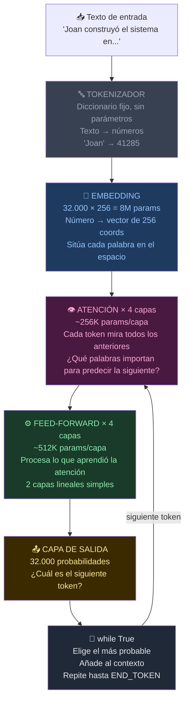
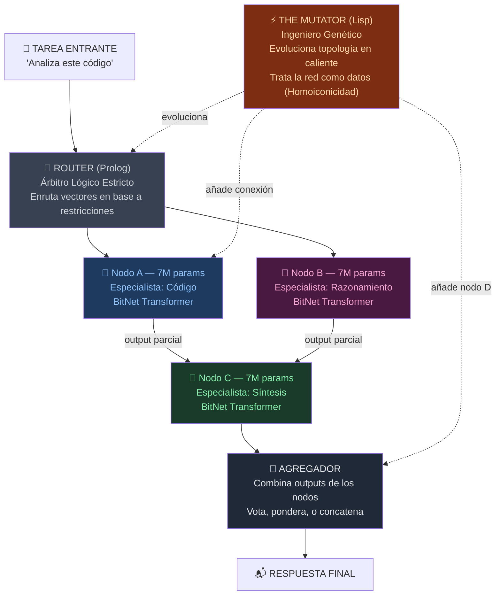
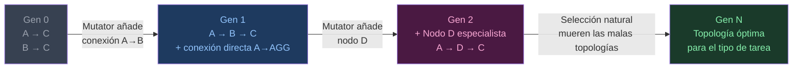

# Frankenswarm — Esquema Visual

## 1. Anatomía de UN nodo BitNet (7M parámetros)



> **BitNet**: Los parámetros de Embedding, Atención y FFN son ternarios: solo **-1, 0, o +1**.
> En vez de multiplicaciones de floats → sumas y restas de enteros. Corre en CPU sin GPU.
> **Lenguaje de Máquina**: La comunicación entre nodos se realiza mediante **embeddings vectoriales nativos**, minimizando las pérdidas del lenguaje humano. Prolog enruta los vectores, Lisp muta la red.

---

## 2. El Frankenswarm — Topología inicial (NEAT Generación 0)



---

## 3. Lo que hace NEAT generación a generación



---

## 4. La diferencia clave con un LLM normal

| | LLM normal | Frankenswarm |
|---|---|---|
| Arquitectura | Fija desde el principio | Evoluciona con NEAT |
| Tamaño | 7B-70B params, una sola red | N × 7M params, múltiples nodos pequeños |
| Hardware | Necesita GPU | BitNet → corre en CPU |
| Especialización | Generalista | Cada nodo puede especializarse |
| Adaptación | Requiere re-entrenamiento | El Mutator reconfecta la topología |

---

## 5. El experimento mínimo viable

```
Generación 0:
  - 3 nodos BitNet de 7M params cada uno
  - Tarea: clasificar tipo de pregunta (código / razonamiento / síntesis)
  - Métrica de fitness: ¿acierta en < N tokens?

El Mutator evalúa cada generación y:
  → Si un nodo no aporta: lo elimina
  → Si el bottleneck está en síntesis: añade un nodo D entre B y C
  → Si A y B siempre aciertan juntos: añade conexión directa A→B
```
