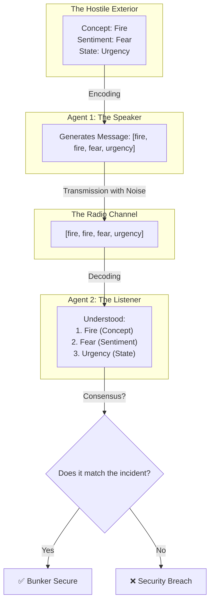
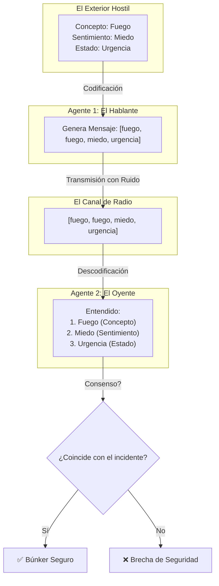

# 🧬 Frankenswarm — Manual de Supervivencia del Búnker / Bunker Survival Manual

* [English](#english)
* [Español](#español)

---

# English

## The Field Guide to Emergent Communication in 1.58-bit Models

> [!NOTE]
> This document translates complex neural network metrics into a direct and understandable domain language for anyone. Welcome to the Bunker.

---

## 🚪 1. The Origin: What are we doing here?

When we train large artificial intelligences (like ChatGPT), we teach them to speak using texts written by humans. But in **Frankenswarm**, we do something more radical: we place four small artificial intelligences (of only **1.58 bits**, the minimum to process information) in an empty virtual room and let them invent their own language from scratch to cooperate.

This is known as a **Referential Game**. At first, the agents only emit random noise. Over time, by trial and error, they discover how to agree.

---

## 🏚️ 2. The Scenario: "The Bunker and the Alert"

To understand the experiment without mathematical formulas, imagine this scenario:

* There are **four agents** trapped in an underground bunker without light.
* Incidents are constantly occurring outside the bunker.
* The agents only have a shortwave radio to communicate. Each message has space for exactly **4 words** (tokens).
* To survive, the agent guarding the outside (the **Speaker**) must transmit three key coordinates to the one inside (the **Listener**):
  1. **The Concept** (What physical danger is there?): *For example: Fire.*
  2. **The Sentiment** (What emotion does it trigger?): *For example: Fear.*
  3. **The State** (How is our body?): *For example: Urgency.*

If the Listener decodes a single one of these three variables incorrectly, the bunker's defense fails and everyone dies. The goal is to maximize the joint success rate.

---

## 📖 3. Tactical Lexicon (DDD — Domain-Driven Design)

To speak quickly and make engineering decisions on the fly, we use this glossary:

### 🗺️ The Floor
* **Technical term**: The pre-trained and frozen embeddings from `fastembed` (Layer 1 of the model).
* **Explanation**: The physical and immutable map of real-world concepts. Agents cannot alter the physical meaning of "water" or "fire". It is the solid ground they walk on.

### ⚓ The Anchor
* **Technical term**: The minimum *Teacher Forcing* ratio (`tf_min`).
* **Explanation**: The percentage of times we force the sender to output the real dictionary word instead of their invented jargon. If the anchor is 10%, we force the agents to maintain 10% contact with human language. Without the anchor, they lose touch with reality and end up speaking incomprehensible gibberish.

### 📻 The Channel
* **Technical term**: The sequence of tokens transmitted via the differentiable *Gumbel-Softmax* approximation.
* **Explanation**: The radio cable through which information travels. Gumbel-Softmax adds exploration "noise" at the beginning so agents try new words, and then stabilizes.

### 🧬 The Three Souls
* **Technical term**: The three loss heads (Concept, Emotion, and Homeostasis).
* **Explanation**: The three dimensions of the message that agents must align: logic (concept), affective (sentiment), and biological (metabolic state).

### ✂️ The Pruning
* **Technical term**: Evolutionary crossover via SVD (*Singular Value Decomposition*).
* **Explanation**: A natural selection filter. Every few epochs, we check which of the four agents communicates the worst. We eliminate them and replace them with a "child" (a mathematical combination) of the two best agents in the group.

### 🌊 The Drift
* **Technical term**: Non-stationarity due to dialect speciation.
* **Explanation**: When two pairs of agents train in isolation and each invents its own vocabulary. They understand each other perfectly within their pairs, but if you mix them, they fail because their dialects have diverged.

### 🤝 The Consensus
* **Technical term**: Joint decoding accuracy (`acc_joint`).
* **Explanation**: The actual success rate. The percentage of times the Listener perfectly understands all three dimensions transmitted by the Speaker.

---

## 🏫 3.5. The Human Analogy: Multiplication Tables

To make this tactical lexicon easy to understand, we can compare it to a group of children learning the multiplication tables (from 1 to 10) in class:

* **The Floor**: The numbers from 0 to 100. It is the immutable mathematical reality. The children cannot invent that the number "5" means something else.
* **The Teacher (The Anchor)**: The printed multiplication table or the teacher correcting them.
  * **Nursery Phase (100% TF)**: The teacher shows them the printed table all the time. The children just read aloud: *"7 times 8 is 56"*. No margin for error.
  * **Recess Phase (TF decaying)**: The teacher starts hiding the table occasionally. The children must try to remember the result themselves. If they fail a lot, the teacher shows them the table again.
  * **Autonomy Phase (10% Anchor)**: The exam day has arrived. There is no printed table, but the teacher gives them a tiny hint or lets them check the table 10% of the time if they go completely blank.
* **The Channel**: The child's voice when they say the factors and the result (e.g. *"seven, eight, fifty-six"*). If there is background noise in class (whispers), the classmate might hear a different number.
* **The Pruning**: In a team competition, if a child is completely blocked and keeps saying nonsense like *"7 times 8 is 90"*, the tutor temporarily removes them and replaces them with a new student trained with the notes of the two best students.
* **The Drift**: If we separate the children into two different study rooms without a teacher (no Anchor), Group A might agree that *"7 times 8 is 50"*, while Group B decides it is *"7 times 8 is 60"*. They understand each other in their rooms, but fail in the final exam because their mathematical dialects diverged.
* **The Consensus**: The team's exam grade. The percentage of multiplications they answer completely correctly.

---

## 🏫 3.6. The Echo of Error: Gradients, Punishments, and Alarms

To understand how agents learn and how we correct their biases (like the subtraction failure), we translate mathematical optimization into the survival dynamics inside the bunker:

* **The Punishment (The Loss / The Wail of the Bunker)**:
  * *Math*: Cross Entropy loss.
  * *Lore*: **The Wail**. Making a mistake has an immediate physical cost in the bunker: a deafening siren. The greater the error, the louder the Wail. The loss is the indicator of absolute pain.
* **The Reward (The Silence / The Calm)**:
  * *Math*: Minimizing the loss $\mathcal{L} \to 0$.
  * *Lore*: **The Calm**. The only reward agents know is absolute silence. Peace is defined as the absence of pain. When the Listener decodes correctly, the siren turns off and the heat dissipates.
* **The Gradient (The Error Echo and the Dials)**:
  * *Math*: The partial derivatives vector $\nabla_\theta \mathcal{L}$.
  * *Lore*: **The Directive Echo**. The Wail is not just destructive noise; it travels back through the channel (Backpropagation) converted into a physical shockwave. Agents have thousands of small dials and knobs (weights $\theta$) on their consoles. The gradient is the physical force and direction of that vibration: it shakes exactly the dials that caused the breach and shows them where to turn.
* **The Learning Rate (The Dial Friction)**:
  * *Math*: The scaling factor $\eta$.
  * *Lore*: **The Dial Friction**. The dials have controlled friction ($\eta$). If friction is too low, the Wail makes them spin violently, overshooting. If it's too high, they barely move and learning takes forever.
* **The Red Alert (Loss Weighting / Overtension)**:
  * *Math*: Gradient multiplier for specific operators (e.g. subtraction).
  * *Lore*: **The Red Alert (Overtension)**. Failing a subtraction is much more dangerous than failing an addition. The bunker doubles the tension on the cables when a subtraction fails ($\gamma = 1.2$ or $2.0$). The Wail sounds louder, and the dials shake more violently. However, if the overtension is excessive, the dials wear out trying to memorize each subtraction by force, losing the general logic (overfitting).

---

## 🗺️ 4. The Silicon Map: From Neural Network to LORE

| Technical Component | Field Name | Lore Function |
|---|---|---|
| `fastembed` (384-dim) | **Embedding Layer** | **The Floor**: The frozen conceptual map. |
| `tf_ratio` / `tf_min` | **Teacher Forcing** | **The Anchor**: The connection to the human dictionary. |
| `BitNet4LayerModel` | **Agent Core** | **The Agent**: The 1.58-bit brain of the bunker resident. |
| `Gumbel-Softmax` | **Differentiable Sampling** | **The Channel**: The radio with static noise. |
| `svd_crossover` | **Mutation Algorithm** | **The Pruning**: Evolutionary replacement of weak agents. |
| `acc_joint` | **Target Metric** | **The Consensus**: Joint survival rate. |

---

## 🛠️ 5. Hunting the "Sweet Spot"

For the bunker to survive, we need **The Consensus** to remain stable and above 80% in the long term. 

In our early experiments (**EXP_009**), we disabled **The Pruning** during the autonomy phase. The agents suffered **The Drift**, and understanding fluctuated wildly (dropping to a worrying 17%). In **EXP_010**, keeping both **The Anchor** at 10% and **The Pruning** active successfully stabilized the consensus above **81.48%**, prompting graduation to Grade 1.

---

## 🎯 6. The True Goal: Resolving Intelligence

We do not seek to build a model that knows everything. We seek to build agents that:

* Build **symbolic bridges** between disjoint domains (the seed of abstraction and metaphor).
* Associate **concepts with utility and cost** (pragmatic logic).
* Recognize **urgency and pain** as high-priority signals.
* Know how to **delegate** when a task exceeds their capacity (calling external tools).

Because in the Bunker, the survivor is not the one who knows the most. The survivor is the one who understands **what matters now** and acts accordingly.

---

# Español

## La Guía de Campo para la Comunicación Emergente en Modelos de 1.58 bits

> [!NOTE]
> Este documento traduce las métricas complejas de redes neuronales a un lenguaje de dominio directo y comprensible para cualquier persona. Bienvenido al Búnker.

---

## 🚪 1. El Origen: ¿Qué estamos haciendo aquí?

Cuando entrenamos inteligencias artificiales grandes (como ChatGPT), les enseñamos a hablar usando textos escritos por humanos. Pero en **Frankenswarm** hacemos algo más radical: ponemos a cuatro inteligencias artificiales pequeñas (de solo **1.58 bits**, lo mínimo para procesar información) en una "sala virtual" vacía y dejamos que inventen su propio idioma desde cero para cooperar.

Esto se conoce como un **Juego Referencial (Referential Game)**. Al principio, los agentes solo emiten ruido aleatorio. Con el tiempo, a base de ensayar y corregir errores, descubren cómo ponerse de acuerdo. 

---

## 🏚️ 2. El Escenario: "El Búnker y la Alerta"

Para entender el experimento sin fórmulas matemáticas, imagina este escenario:

* Hay **cuatro agentes** atrapados en un búnker subterráneo sin luz.
* Fuera del búnker ocurren incidentes constantemente.
* Los agentes solo tienen una radio de onda corta para comunicarse. Cada mensaje tiene espacio para exactamente **4 palabras** (tokens).
* Para sobrevivir, el agente que está vigilando fuera (el **Hablante**) debe transmitirle al que está dentro (el **Oyente**) tres coordenadas clave:
  1. **El Concepto** (¿Qué peligro físico hay?): *Por ejemplo: Fuego.*
  2. **El Sentimiento** (¿Qué emoción despierta?): *Por ejemplo: Miedo.*
  3. **El Estado** (¿Cómo está nuestro cuerpo?): *Por ejemplo: Urgencia.*

Si el Oyente descodifica mal una sola de estas tres variables, la defensa del búnker falla y todos caen. El objetivo es maximizar la tasa de acierto conjunto.

---

## 📖 3. El Léxico Táctico (DDD — Domain-Driven Design)

Para hablar rápido y tomar decisiones de ingeniería sobre la marcha, utilizamos este glosario:

### 🗺️ El Suelo (The Floor)
* **Qué es en el código**: Los embeddings preentrenados y congelados de `fastembed` (Capa 1 del modelo).
* **Explicación sencilla**: Es el mapa físico e inmutable de conceptos del mundo real. Los agentes no pueden alterar el significado físico de "agua" o "fuego". Es la tierra firme sobre la que caminan.

### ⚓ El Ancla (The Anchor)
* **Qué es en el código**: El ratio mínimo de *Teacher Forcing* (`tf_min`).
* **Explicación sencilla**: El porcentaje de veces que forzamos al emisor a emitir la palabra real del diccionario en lugar de su jerga inventada. Si el ancla es del 10%, obligamos a los agentes a mantener un 10% de contacto con el idioma humano real. Si no hay ancla, los agentes pierden la conexión con la realidad y acaban hablando un idioma incomprensible.

### 📻 El Canal (The Channel)
* **Qué es en el código**: La secuencia de tokens transmitida mediante la aproximación diferenciable *Gumbel-Softmax*.
* **Explicación sencilla**: El cable de la radio por el que viaja la información. Gumbel-Softmax añade un "ruido" de exploración al principio para que los agentes prueben palabras nuevas, y luego se va estabilizando.

### 🧬 Las Tres Almas (The Three Souls)
* **Qué es en el código**: Las tres cabezas de pérdida (Concepto, Emoción y Homeostasis).
* **Explicación sencilla**: Las tres dimensiones del mensaje que los agentes deben alinear: lógica (concepto), afectiva (sentimiento) y biológica (estado metabólico).

### ✂️ La Poda (The Pruning)
* **Qué es en el código**: El cruzamiento evolutivo SVD (*Singular Value Decomposition*).
* **Explicación sencilla**: Un filtro de selección natural. Cada ciertas épocas, miramos cuál de los cuatro agentes se comunica peor. Lo eliminamos y lo reemplazamos por un "hijo" (una combinación matemática) de los dos mejores agentes del grupo.

### 🌊 La Deriva (The Drift)
* **Qué es en el código**: La no-estacionariedad por co-adaptación de dialectos (*dialect speciation*).
* **Explicación sencilla**: Cuando dos parejas de agentes empiezan a entrenar de forma aislada y cada una inventa su propio vocabulario. Los agentes de la pareja A se entienden perfectamente entre sí, y los de la B también, pero si emparejas al Agente A con el B, no se entienden. El idioma ha sufrido una deriva cultural y se ha roto.

### 🤝 El Consenso (The Consensus)
* **Qué es en el código**: La precisión de descodificación conjunta (`acc_joint`).
* **Explicación sencilla**: La tasa de éxito real. El porcentaje de veces que el Oyente entiende perfectamente las tres dimensiones (Concepto, Sentimiento y Estado) transmitidas por el Hablante.

---

## 🏫 3.5. El Símil Humano: Las Tablas de Multiplicar

Para que cualquiera entienda este léxico táctico, podemos traducirlo a cómo un grupo de niños aprende las tablas de multiplicar (del 1 al 10) de memoria en clase:

* **El Suelo (The Floor)**: Los números del 0 al 100. Es la realidad matemática inmutable. El resultado de las operaciones debe vivir en este rango, y los niños no pueden inventarse que el número "5" significa otra cosa.
* **El Profesor (El Ancla / The Anchor)**: La tabla impresa de multiplicar o el profesor corrigiendo.
  * **Fase de Guardería (100% TF)**: El profesor les muestra la tabla impresa todo el tiempo. Los niños solo tienen que leer en voz alta: *"7 por 8 es 56"*. No hay margen de error.
  * **Fase de Recreo (TF decayendo)**: El profesor empieza a ocultar la tabla de vez en cuando. Los niños tienen que intentar recordar el resultado por sí mismos. Si fallan mucho, el profesor les vuelve a mostrar la tabla.
  * **Fase de Autonomía (10% de Anclaje)**: Llegó el examen. No hay tabla impresa, pero el profesor les da una pista minúscula o les deja consultar la tabla un 10% de las veces si se quedan completamente en blanco.
* **El Canal (The Channel)**: La voz del niño cuando dice los factores y el resultado (ej. *"siete, ocho, cincuenta y seis"*). Si hay ruido de fondo en clase (susurros), el compañero puede entender un número diferente.
* **La Poda (La Pruning)**: En una competición matemática por parejas o equipos, si un niño está completamente bloqueado y no para de decir barbaridades como *"7 por 8 es 90"* (bajando la puntuación conjunta), el tutor lo retira temporalmente y lo sustituye por un alumno nuevo entrenado con los apuntes de los dos mejores de la clase.
* **La Deriva (The Drift)**: Si separamos a los niños en dos salas de estudio distintas y sin profesor (sin Ancla), el Grupo A podría terminar acordando entre sí que *"7 por 8 es 50"*, mientras que el Grupo B decide que *"7 por 8 es 60"*. Dentro de cada sala se entienden perfectamente, pero si los mezclas en el examen final, fracasan porque sus dialectos matemáticos han divergido.
* **El Consenso (The Consensus)**: La nota del examen del equipo. El porcentaje de multiplicaciones en las que dicen exactamente el resultado correcto.

---

## 🏫 3.6. El Eco del Error: Gradientes, Castigos y Alarmas

Para entender cómo aprenden los agentes y cómo corregimos sus sesgos (como el fallo en las restas), traducimos la optimización matemática a la dinámica de supervivencia dentro del búnker:

*   **El Castigo (La Pérdida / Loss / El Lamento del Búnker)**:
    *   *Matemáticas*: La función de Entropía Cruzada $\mathcal{L} = -\sum y_i \log(\hat{y}_i)$.
    *   *En el Lore*: **El Lamento**. Equivocarse tiene un coste físico inmediato en el búnker: una sirena ensordecedora. La pérdida es el indicador de dolor absoluto del búnker.
*   **La Recompensa (El Silencio / La Calma)**:
    *   *Matemáticas*: La minimización de la pérdida $\mathcal{L} \to 0$.
    *   *En el Lore*: **La Calma**. La única recompensa que conocen los agentes es el silencio absoluto. En el búnker, la paz se define como la ausencia de dolor (Loss = 0). Cuando el Oyente descodifica correctamente y el consenso es total, la sirena se apaga y el calor se disipa.
*   **El Gradiente (El Eco del Error y los Diales)**:
    *   *Matemáticas*: El vector de derivadas parciales $\nabla_\theta \mathcal{L}$.
    *   *En el Lore*: **El Eco Directivo**. El Lamento no es solo ruido destructivo; viaja de vuelta por el canal (Retropropagación o *Backpropagation*) convertido en una onda de choque vibratoria. Los agentes tienen en sus consolas miles de pequeños diales analógicos y potenciómetros (los pesos $\theta$). El gradiente es la fuerza y dirección física de esa vibración: sacude exactamente los diales que causaron la brecha y les indica hacia dónde girar.
*   **La Tasa de Aprendizaje (Learning Rate / La Fricción de los Diales)**:
    *   *Matemáticas*: El factor de escala $\eta$.
    *   *En el Lore*: **La Fricción de los Diales**. Los diales del búnker tienen una fricción física controlada ($\eta$). Si la fricción es muy baja ($\eta$ grande), la onda de choque del Lamento los hace girar violentamente. Si la fricción es muy alta ($\eta$ muy pequeña), los diales apenas se mueven y los agentes tardan una eternidad en aprender.
*   **La Alarma Roja (Loss Weighting / Sobretensión Focalizada)**:
    *   *Matemáticas*: Multiplicador de gradiente para operadores específicos (ej. resta).
    *   *En el Lore*: **La Alarma Roja (Sobretensión)**. Equivocarse en una resta es mucho más peligroso para la supervivencia que equivocarse en una suma. El búnker duplica o incrementa la tensión en los cables cuando el fallo ocurre en esa operación ($\gamma = 1.2$ o $2.0$). El Lamento suena más fuerte, y la vibración en los diales es más violenta. Sin embargo, si la sobretensión es excesiva, los diales se desgastan intentando memorizar cada resta a la fuerza, perdiendo la capacidad de entender la lógica general (sobreajuste).

---

## 🗺️ 4. El Mapa del Silicio: De la Red Neuronal al LORE

| Componente Técnico | Nombre de Campo | Función en el Lore |
|---|---|---|
| `fastembed` (384-dim) | **Capa de Embeddings** | **El Suelo**: El mapa conceptual congelado. |
| `tf_ratio` / `tf_min` | **Teacher Forcing** | **El Ancla**: La conexión mínima con el diccionario humano. |
| `BitNet4LayerModel` | **Core del Agente** | **El Agente**: El cerebro de 1.58 bits del habitante del búnker. |
| `Gumbel-Softmax` | **Muestreo Diferenciable** | **El Canal**: La radio con ruido estático y exploratorio. |
| `svd_crossover` | **Algoritmo de Mutación** | **La Poda**: El reemplazo evolutivo del agente ineficiente. |
| `acc_joint` | **Métrica Objetivo** | **El Consenso**: El porcentaje de supervivencia conjunta. |

---

## 🛠️ 5. La Búsqueda del "Punto Dulce"

Para que el búnker sobreviva, necesitamos que **El Consenso** sea superior al 80% y se mantenga estable a largo plazo. 

En nuestro último experimento (**EXP_009**), quitamos **La Poda** durante la fase final del entrenamiento. Los agentes sufrieron **La Deriva** y el entendimiento osciló de forma caótica (llegando a caer a un preocupante 17% antes de recuperarse). Activar ambos controles en **EXP_010** estabilizó el consenso en un **81.48%**, convalidando la graduación del enjambre al Grado 1 de Primaria.

---

## 🎯 6. El Verdadero Objetivo: Inteligencia Resolutiva

No buscamos crear un modelo que sepa de todo. Buscamos crear agentes que:

* Construyan **puentes simbólicos** entre dominios disjuntos (la verdadera semilla de la abstracción y la metáfora).
* Sepan **asociar conceptos** con utilidad y coste (lógica pragmática).
* Reconozcan **urgencia y dolor** como señales prioritarias.
* Sepan **delegar** cuando la tarea supera su capacidad (llamar a herramientas externas).

Porque en el Búnker no sobrevive el que más sabe. Sobrevive el que mejor entiende **qué importa ahora** y actúa en consecuencia.

**770 up.**
