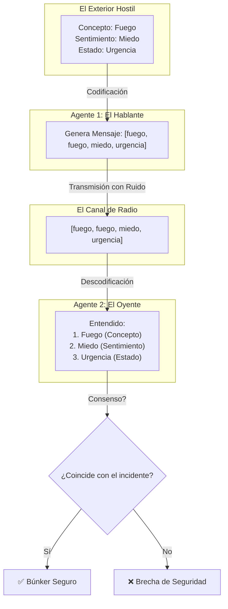

# 🧬 Frankenswarm — Manual de Supervivencia del Búnker
## La Guía de Campo para la Comunicación Emergente en Modelos de 1.58 bits

> [!NOTE]
> Este documento traduce las métricas complejas de redes neuronales a un lenguaje de dominio directo y comprensible para cualquier persona. Bienvenido al Búnker.

---

## 🚪 1. El Origen: ¿Qué estamos haciendo aquí?

Cuando entrenamos inteligencias artificiales grandes (como ChatGPT), les enseñamos a hablar usando textos escritos por humanos. Pero en **Frankenswarm** hacemos algo más radical: ponemos a cuatro inteligencias artificiales pequeñas (de solo **1.58 bits**, lo mínimo para procesar información) en una "sala virtual" vacía y dejamos que inventen su propio idioma desde cero para cooperar.

Esto se conoce como un **Juego Referencial (Referential Game)**. Al principio, los agentes solo emiten ruido aleatorio. Con el tiempo, a base de ensayar y corregir errores, descubren cómo ponerse de acuerdo. 

---

## 🏚️ 2. El Escenario: "El Búnker y la Alerta"

Para entender el experimento sin fórmulas matemáticas, imagina este escenario:

* Hay **cuatro agentes** atrapados en un búnker subterráneo sin luz.
* Fuera del búnker ocurren incidentes constantemente.
* Los agentes solo tienen una radio de onda corta para comunicarse. Cada mensaje tiene espacio para exactamente **4 palabras** (tokens).
* Para sobrevivir, el agente que está vigilando fuera (el **Hablante**) debe transmitirle al que está dentro (el **Oyente**) tres coordenadas clave:
  1. **El Concepto** (¿Qué peligro físico hay?): *Por ejemplo: Fuego.*
  2. **El Sentimiento** (¿Qué emoción despierta?): *Por ejemplo: Miedo.*
  3. **El Estado** (¿Cómo está nuestro cuerpo?): *Por ejemplo: Urgencia.*

Si el Oyente descodifica mal una sola de estas tres variables, la defensa del búnker falla y todos caen. El objetivo es maximizar la tasa de acierto conjunto.

---

## 📖 3. El Léxico Táctico (DDD — Domain-Driven Design)

Para hablar rápido y tomar decisiones de ingeniería sobre la marcha, utilizamos este glosario:

### 🗺️ El Suelo (The Floor)
* **Qué es en el código**: Los embeddings preentrenados y congelados de `fastembed` (Capa 1 del modelo).
* **Explicación sencilla**: Es el mapa físico e inmutable de conceptos del mundo real. Los agentes no pueden alterar el significado físico de "agua" o "fuego". Es la tierra firme sobre la que caminan.

### ⚓ El Ancla (The Anchor)
* **Qué es en el código**: El ratio mínimo de *Teacher Forcing* (`tf_min`).
* **Explicación sencilla**: El porcentaje de veces que forzamos al emisor a emitir la palabra real del diccionario en lugar de su jerga inventada. Si el ancla es del 10%, obligamos a los agentes a mantener un 10% de contacto con el idioma humano real. Si no hay ancla, los agentes pierden la conexión con la realidad y acaban hablando un idioma incomprensible.

### 📻 El Canal (The Channel)
* **Qué es en el código**: La secuencia de tokens transmitida mediante la aproximación diferenciable *Gumbel-Softmax*.
* **Explicación sencilla**: El cable de la radio por el que viaja la información. Gumbel-Softmax añade un "ruido" de exploración al principio para que los agentes prueben palabras nuevas, y luego se va estabilizando.

### 🧬 Las Tres Almas (The Three Souls)
* **Qué es en el código**: Las tres cabezas de pérdida (Concepto, Emoción y Homeostasis).
* **Explicación sencilla**: Las tres dimensiones del mensaje que los agentes deben alinear: lógica (concepto), afectiva (sentimiento) y biológica (estado metabólico).

### ✂️ La Poda (The Pruning)
* **Qué es en el código**: El cruzamiento evolutivo SVD (*Singular Value Decomposition*).
* **Explicación sencilla**: Un filtro de selección natural. Cada ciertas épocas, miramos cuál de los cuatro agentes se comunica peor. Lo eliminamos y lo reemplazamos por un "hijo" (una combinación matemática) de los dos mejores agentes del grupo.

### 🌊 La Deriva (The Drift)
* **Qué es en el código**: La no-estacionariedad por co-adaptación de dialectos (*dialect speciation*).
* **Explicación sencilla**: Cuando dos parejas de agentes empiezan a entrenar de forma aislada y cada una inventa su propio vocabulario. Los agentes de la pareja A se entienden perfectamente entre sí, y los de la B también, pero si emparejas al Agente A con el B, no se entienden. El idioma ha sufrido una deriva cultural y se ha roto.

### 🤝 El Consenso (The Consensus)
* **Qué es en el código**: La precisión de descodificación conjunta (`acc_joint`).
* **Explicación sencilla**: La tasa de éxito real. El porcentaje de veces que el Oyente entiende perfectamente las tres dimensiones (Concepto, Sentimiento y Estado) transmitidas por el Hablante.

---

## 🏫 3.5. El Símil Humano: Las Tablas de Multiplicar

Para que cualquiera entienda este léxico táctico, podemos traducirlo a cómo un grupo de niños aprende las tablas de multiplicar (del 1 al 10) de memoria en clase:

* **El Suelo (The Floor)**: Los números del 0 al 100. Es la realidad matemática inmutable. El resultado de las operaciones debe vivir en este rango, y los niños no pueden inventarse que el número "5" significa otra cosa.
* **El Profesor (El Ancla / The Anchor)**: La tabla impresa de multiplicar o el profesor corrigiendo.
  * **Fase de Guardería (100% TF)**: El profesor les muestra la tabla impresa todo el tiempo. Los niños solo tienen que leer en voz alta: *"7 por 8 es 56"*. No hay margen de error.
  * **Fase de Recreo (TF decayendo)**: El profesor empieza a ocultar la tabla de vez en cuando. Los niños tienen que intentar recordar el resultado por sí mismos. Si fallan mucho, el profesor les vuelve a mostrar la tabla.
  * **Fase de Autonomía (10% de Anclaje)**: Llegó el examen. No hay tabla impresa, pero el profesor les da una pista minúscula o les deja consultar la tabla un 10% de las veces si se quedan completamente en blanco.
* **El Canal (The Channel)**: La voz del niño cuando dice los factores y el resultado (ej. *"siete, ocho, cincuenta y seis"*). Si hay ruido de fondo en clase (susurros), el compañero puede entender un número diferente.
* **La Poda (La Pruning)**: En una competición matemática por parejas o equipos, si un niño está completamente bloqueado y no para de decir barbaridades como *"7 por 8 es 90"* (bajando la puntuación conjunta), el tutor lo retira temporalmente y lo sustituye por un alumno nuevo entrenado con los apuntes de los dos mejores de la clase.
* **La Deriva (The Drift)**: Si separamos a los niños en dos salas de estudio distintas y sin profesor (sin Ancla), el Grupo A podría terminar acordando entre sí que *"7 por 8 es 50"*, mientras que el Grupo B decide que *"7 por 8 es 60"*. Dentro de cada sala se entienden perfectamente, pero si los mezclas en el examen final, fracasan porque sus dialectos matemáticos han divergido.
* **El Consenso (The Consensus)**: La nota del examen del equipo. El porcentaje de multiplicaciones en las que dicen exactamente el resultado correcto.

---

## 🏫 3.6. El Eco del Error: Gradientes, Castigos y Alarmas

Para entender cómo aprenden los agentes y cómo corregimos sus sesgos (como el fallo en las restas), traducimos la optimización matemática a la dinámica de supervivencia dentro del búnker:

*   **La Pérdida (Loss / El Lamento del Búnker)**:
    *   *Matemáticas*: La función de Entropía Cruzada $\mathcal{L} = -\sum y_i \log(\hat{y}_i)$.
    *   *En el Lore*: **El Lamento**. Cada vez que un agente comete un error al calcular o decodificar, suena una sirena de alarma en el búnker. Cuanto mayor es el fallo, más alto es el volumen del Lamento. El objetivo de los agentes es ajustar sus mentes hasta que el búnker esté en absoluto silencio (Loss cercano a 0).
*   **El Gradiente (Gradient / El Eco del Error)**:
    *   *Matemáticas*: La derivada de la pérdida respecto a los pesos $\nabla_w \mathcal{L}$.
    *   *En el Lore*: **El Eco del Error**. Cuando suena la alarma, el sonido viaja hacia atrás por los cables de la radio (Retropropagación / *Backpropagation*). Este eco golpea las neuronas de los agentes y les indica exactamente qué conexiones sinápticas causaron el fallo y en qué dirección deben girar sus diales internos (pesos de 1.58 bits) para que la próxima vez la alarma suene más floja.
*   **El Castigo Amplificado (Loss Weighting / La Alarma Roja)**:
    *   *Matemáticas*: Multiplicador de gradiente $\mathcal{L}_{\text{weighted}} = \mathcal{L} \times (1.0 + 1.0 \cdot \mathbb{I}(\text{op} = \text{resta}))$.
    *   *En el Lore*: **La Alarma Roja**. En el búnker, equivocarse en una suma es un problema, pero equivocarse en una resta es una brecha de seguridad letal (un error al restar puede hacer que sobreestimemos los recursos de defensa). Para solucionarlo, configuramos la radio para que, si el fallo ocurre en una resta, el volumen del Lamento se duplique. El Eco del Error golpea las neuronas con el doble de fuerza, forzando a los agentes a recalibrar la lógica de la resta con máxima prioridad.

---

## 🗺️ 4. El Mapa del Silicio: De la Red Neuronal al LORE

| Componente Técnico | Nombre de Campo | Función en el Lore |
|---|---|---|
| `fastembed` (384-dim) | **Capa de Embeddings** | **El Suelo**: El mapa conceptual congelado. |
| `tf_ratio` / `tf_min` | **Teacher Forcing** | **El Ancla**: La conexión mínima con el diccionario humano. |
| `BitNet4LayerModel` | **Core del Agente** | **El Agente**: El cerebro de 1.58 bits del habitante del búnker. |
| `Gumbel-Softmax` | **Muestreo Diferenciable** | **El Canal**: La radio con ruido estático y exploratorio. |
| `svd_crossover` | **Algoritmo de Mutación** | **La Poda**: El reemplazo evolutivo del agente ineficiente. |
| `acc_joint` | **Métrica Objetivo** | **El Consenso**: El porcentaje de supervivencia conjunta. |

---

## 🛠️ 5. La Búsqueda del "Punto Dulce"

Para que el búnker sobreviva, necesitamos que **El Consenso** sea superior al 80% y se mantenga estable a largo plazo. 

En nuestro último experimento (**EXP_009**), quitamos **La Poda** durante la fase final del entrenamiento. Los agentes sufrieron **La Deriva** y el entendimiento osciló de forma caótica (llegando a caer a un preocupante 17% antes de recuperarse).

Ahora mismo estamos listos para lanzar dos nuevas pruebas para cazar el Punto Dulce:
1. **EXP_010**: Mantener **El Ancla** al 10%, pero dejar **La Poda** activa de forma constante.
2. **EXP_011**: Subir **El Ancla** al 15% para darles más señal del mundo exterior, y mantener **La Poda** activa.

---

## 🎯 6. El Verdadero Objetivo: Inteligencia Resolutiva

No buscamos crear un modelo que sepa de todo.  
Buscamos crear agentes que:

- Construyan **puentes simbólicos** entre dominios disjuntos (la verdadera semilla de la abstracción y la metáfora, habilitadora de toda comunicación compleja).
- Sepan **asociar conceptos** con utilidad y coste (lógica pragmática).
- Reconozcan **urgencia y dolor** como señales prioritarias.
- Sepan **delegar** cuando la tarea supera su capacidad (llamar a herramientas externas).

Porque en el Búnker no sobrevive el que más sabe.  
Sobrevive el que mejor entiende **qué importa ahora** y actúa en consecuencia.

**770 up.**
