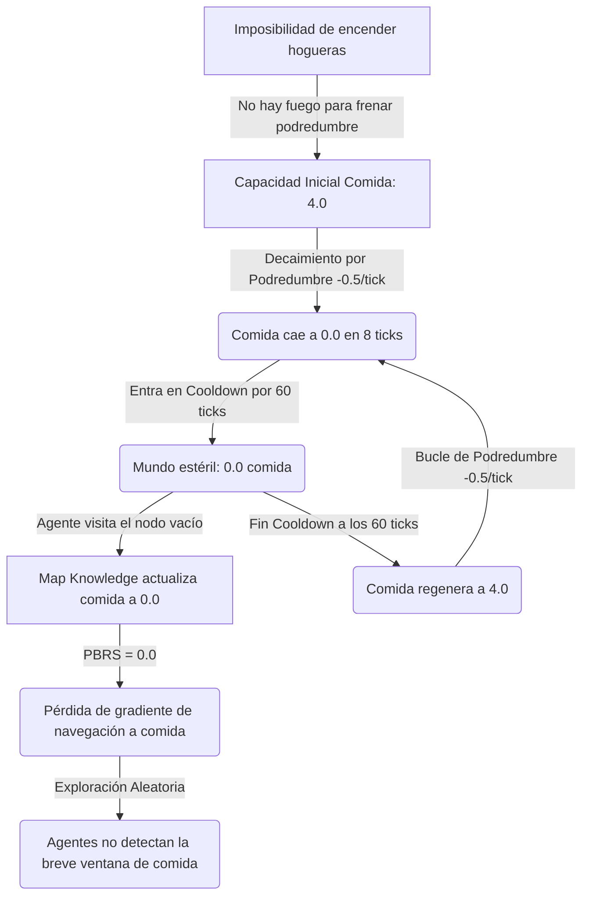

# Análisis de Inanición en la Arena Cooperativa (EXP_077)

Este informe presenta un análisis quirúrgico de la trayectoria de simulación grabada en [task-5697.log](file:///home/joan/.gemini/antigravity/brain/986706db-9916-42f4-9fef-59f7b69db4be/.system_generated/tasks/task-5697.log) para determinar la causa raíz de la muerte prematura por inanición de los agentes Nico (A), Sofi (B) y Hugo (C).

---

## 1. El Diagnóstico: Por qué se mueren de hambre
Los agentes **no comen porque no hay comida física en el mapa durante el 88% del tiempo**, y cuando la hay, sufren de **ceguera cognitiva** (mapa de memoria obsoleto) que les impide navegar hacia los recursos.

El análisis de la simulación revela cuatro cuellos de botella sistémicos interconectados:



### A. La Trampa de la Podredumbre y Scarcity Extrema
En la configuración de `EXP_077_dojo_shout_levels.json`, los parámetros del entorno están configurados de forma asimétrica respecto a `EXP_073`:
*   `resource_recovery` = `0.0` (frente a `0.5` en `EXP_073`)
*   `replenish_cooldown_ticks` = `60`
*   `hunger_rate` = `2.5` (frente a `1.5` en `EXP_073`, un incremento del 66% en el desgaste metabólico)

Debido al código de decaimiento en `_tick_world` ([cooperative_world.py:L669-673](file:///home/joan/Documents/IA/frankenswarm/src/bitnet/cooperative_world.py#L669-673)):
```python
		# Decaimiento (podrido) de la comida en el suelo si no hay hoguera
		for loc, caps in self.resource_capacities.items():
			if caps["food"] > 0.0 and self.fire_locations.get(loc, 0) == 0:
				caps["food"] = max(0.0, caps["food"] - 0.5)
				if caps["food"] <= 0.0 and self.replenish_cooldown_ticks > 0:
					self.resource_cooldowns[loc]["food"] = self.replenish_cooldown_ticks
```
Toda la comida del suelo (incluidos los peces de los lagos/ríos) **se pudre a una tasa de 0.5 por tick**. Como no hay hogueras activas, los recursos iniciales de 4.0 unidades desaparecen por completo en el **Tick 8**. A partir de ahí, entran en un cooldown de **60 ticks** antes de volver a aparecer.

*   **Ciclo de comida disponible**: 8 ticks con comida en degradación rápida, seguidos de 60 ticks de desierto absoluto.
*   **Disponibilidad temporal**: La comida solo existe en el mapa durante el **11.7% de la simulación**.

### B. El Cierre Genético contra el Fuego
El decaimiento por podredumbre se detiene si hay una hoguera en la localización. Sin embargo, encender una hoguera requiere la habilidad `"fuego"` y la acción `"encender"`.

Los agentes se inicializan en el constructor con habilidades fijas ([cooperative_world.py:L316-324](file:///home/joan/Documents/IA/frankenswarm/src/bitnet/cooperative_world.py#L316-324)):
*   Nico (A): `["comida", "agua"]`
*   Sofi (B): `["comida", "caza"]`
*   Hugo (C): `["agua", "caza"]`

Ningún agente fundador posee la habilidad `"fuego"`, `"artesanía"`, o `"cocina"`. Como el aprendizaje de habilidades en la simulación requiere un maestro que ya posea la habilidad para enseñarla, **los agentes están genéticamente impedidos de descubrir el fuego**. La podredumbre de comida es, por tanto, **inevitable**.

### C. Amnesia y Pérdida de Gradiente del Mapa Cognitivo
Cuando el agente visita un nodo de recursos y ve que está agotado, actualiza su `map_knowledge` ([cooperative_world.py:L724-728](file:///home/joan/Documents/IA/frankenswarm/src/bitnet/cooperative_world.py#L724-728)):
```python
		agent.map_knowledge[loc] = {
			"food": caps["food"],
			"water": caps["water"],
			"last_updated": self.world_tick
		}
```
Una vez que el mapa del agente registra `"food": 0.0` para todos los nodos conocidos (Bosque, Río, Valle, Pantano, Ruinas), la función de recompensa por aproximación a recursos conocidos (PBRS) en `get_reward` se apaga ([cooperative_world.py:L1915-1920](file:///home/joan/Documents/IA/frankenswarm/src/bitnet/cooperative_world.py#L1915-1920)):
```python
				if agent.hambre < 70:
					known_food_locs = [loc for loc, info in agent.map_knowledge.items() if info.get("food", 0.0) >= 1.0]
					if known_food_locs:
						...
						shaping_reward += (d_prev - d_curr) * 0.2
```
Cuando la comida se regenera a los 60 ticks (por ejemplo en el Tick 69), **los agentes no tienen forma de saberlo**. Su memoria sigue indicando que la comida está en `0.0`. Sin gradiente de recompensa que los guíe, los agentes se quedan atrapados en bucles locales de confort (Nico bebiendo agua sin parar en el Lago, Hugo durmiendo en la Montaña) y fallan completamente en explorar en el momento preciso del desove.

### D. Ruido de Señalización (Gritos Mentirosos)
La red neuronal aprende a gritar para obtener recompensas cooperativas, pero como los gritos se seleccionan por logits sin validación estricta de veracidad, Nico grita `[bosque, comida]` en el Tick 26 cuando el bosque tiene `0.0` comida.
*   Esto actualiza de forma falsa el `map_knowledge` de los receptores (Sofi y Hugo), enviándolos en un viaje estéril hacia el Bosque vacío, desgastando su energía vital en navegación inútil.

---

## 2. Contramedidas propuestas

Para romper este bucle de inanición y hacer que la simulación de `EXP_077` sea viable, propongo el siguiente plan de ajustes:

### Ajuste A: Suavizar las reglas de regeneración ecológica
Si deseamos mantener el cooldown de agotamiento (60 ticks) para obligar a los agentes a moverse, debemos reducir la velocidad de putrefacción para darles margen de reacción, o permitir una recuperación pasiva y lenta:
1.  **Reducir el decaimiento de comida**: Pasar de `-0.5` ticks a `-0.1` o `-0.05` ticks por paso para que la comida en el suelo dure más de 8 ticks.
2.  **Activar recuperación gradual**: Ajustar `"resource_recovery"` en la configuración a un valor positivo mínimo (`0.1` o `0.2`) para que la comida no dependa puramente del cooldown destructivo.
3.  **Proteger la fauna**: Impedir que los peces de Lago, Río y Pantano decaigan por podredumbre en el suelo (mantener su nivel estable o con un decaimiento mucho menor).

### Ajuste B: Desbloqueo del Árbol Tecnológico (Fuego y Herramientas)
Debemos sembrar las semillas tecnológicas en la población fundadora. Si un agente empieza con la habilidad, la dinámica de transmisión de conocimiento (Dojo + Consolidación) permitirá que se propague:
*   Asignar la habilidad `"artesanía"` a **Hugo (C)** para que fabrique lanzas y recolecte materiales.
*   Asignar la habilidad `"fuego"` a **Sofi (B)** para que encienda hogueras en los refugios (evitando la podredumbre).
*   Asignar la habilidad `"cocina"` a **Nico (A)** para que cocine guisos calientes con comida y agua, obteniendo máxima saciedad.

### Ajuste C: Caducidad y Olvido en la Memoria del Mapa (Cognición Temporal)
Para resolver la ceguera tras el decaimiento de comida, debemos implementar un mecanismo de **esperanza o curiosidad** en el mapa mental:
*   Si una localización no ha sido visitada ni se han recibido gritos sobre ella en los últimos `N` ticks (ej. 30 ticks), la estimación de su recurso en `map_knowledge` debe volver a su nivel teórico base (`5.0`), motivando al agente a re-explorarla bajo el gradiente PBRS.

### Ajuste D: Penalización por Falso Testimonio
Incrementar la penalización cooperativa por dar gritos de comida en localizaciones estériles. Si el receptor llega al destino sugerido por un grito y no encuentra nada, el emisor debe sufrir una penalización severa (`-5.0` en lugar de `-1.0`) para desalentar políticas ruidosas.

---

## 3. Código a modificar para implementar las soluciones

### I. Modificación en `CoopAgentState.__post_init__` ([cooperative_world.py](file:///home/joan/Documents/IA/frankenswarm/src/bitnet/cooperative_world.py#L316-324))
Propuesta de redistribución de habilidades iniciales para habilitar el fuego y la artesanía:
```python
		if self.learned_skills is None:
			if self.agent_id == "a":
				self.learned_skills = ["comida", "agua", "cocina"]
			elif self.agent_id == "b":
				self.learned_skills = ["comida", "caza", "fuego"]
			elif self.agent_id == "c":
				self.learned_skills = ["agua", "caza", "artesanía"]
			else: # Domi / d
				self.learned_skills = []
```

### II. Modificación en `get_reward` para la caducidad del mapa cognitivo ([cooperative_world.py](file:///home/joan/Documents/IA/frankenswarm/src/bitnet/cooperative_world.py#L1915-1925))
Podemos introducir un factor de reactivación de curiosidad temporal si la información del mapa es demasiado vieja:
```python
				# Guiar hacia comida si tiene hambre
				if agent.hambre < 70:
					# Si la información del mapa es vieja, reactivar curiosidad reseteando la estimación al valor base (5.0)
					for l, info in agent.map_knowledge.items():
						if self.world_tick - info.get("last_updated", 0) > 35:
							if COOP_LOCATIONS[l]["food_eligible"] or COOP_LOCATIONS[l].get("fish_eligible"):
								info["food"] = 5.0
					
					known_food_locs = [loc for loc, info in agent.map_knowledge.items() if info.get("food", 0.0) >= 1.0]
```
