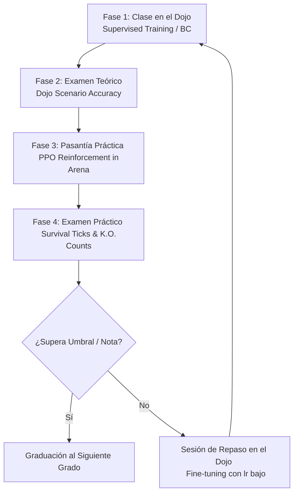

# Plan Curricular y Ruta de Aprendizaje de la Arena (Dojo of PopuLoRA)

Este documento define la estructura oficial de educación, entrenamiento y evaluación para los agentes de la Arena (*Nico, Sofy, Hugo y Domi*). Establece un ciclo de aprendizaje iterativo que combina el entrenamiento guiado por profesor (Dojo) y la adaptación por refuerzo (Arena), simulando el desarrollo educativo humano.

---

## 🏫 El Ciclo Educativo (Dojo-Arena Loop)

Para entrenar a un agente (ya sea desde cero o incorporando una nueva mecánica), se sigue el siguiente flujo de cuatro fases:

---

## 📚 Grados Académicos y Plan de Estudios

### 👶 Grado 1: Autonomía y Homeostasis Básica (Kindergarten)
* **Objetivo:** Sobrevivir individualmente en un entorno estático con abundancia de recursos.
* **Habilidades a enseñar:**
  * Comer del suelo si hay hambre y hay comida disponible localmente.
  * Beber del suelo si hay sed y hay agua disponible localmente (Nico y Hugo).
  * Dormir si la energía es muy baja ($<25$).
  * Moverse (desplazarse) si el nodo actual está agotado para buscar recursos adyacentes.
* **Dificultad de la Arena asociada:** **FÁCIL** (sin depredadores, sin tormentas, regeneración rápida de recursos, sin cooldowns).
* **Métricas de Examen:**
  * **Examen Teórico (Dojo):** Precisión del lote sintético $> 95\%$ en toma de decisiones básicas.
  * **Examen Práctico (Arena):** Supervivencia individual $> 100$ ticks sin desmayos (K.O.).
* **Diploma:** *Autónomo Básico*.

---

### 👦 Grado 2: Migración y Gestión de Inventario (Primaria)
* **Objetivo:** Navegar en el grafo del mundo cooperativo y gestionar recursos portátiles ante la escasez local.
* **Habilidades a enseñar:**
  * Comer de la mochila si no hay comida en el suelo.
  * Beber de la mochila si no hay agua en el suelo.
  * Moverse intencionadamente hacia localizaciones específicas si se agota el recurso local.
  * Explorar nodos alternativos cuando el estado corporal es óptimo (evitar acampar en un solo nodo).
* **Dificultad de la Arena asociada:** **MEDIA** (recursos finitos con cooldown de 60 ticks, sin depredadores letales).
* **Métricas de Examen:**
  * **Examen Teórico (Dojo):** Precisión en gestión de mochila e intenciones de movimiento $> 92\%$.
  * **Examen Práctico (Arena):** Supervivencia individual $> 150$ ticks en migración constante.
* **Diploma:** *Explorador de la Arena*.

---

### 🗣️ Grado 3: Comunicación Altruista y Teoría de la Mente (Secundaria)
* **Objetivo:** Cooperar activamente mediante el uso de gritos, el intercambio de recursos y la lectura de Theory of Mind (ToM).
* **Habilidades a enseñar:**
  * **Gritar** pidiendo `"comida"` o `"agua"` cuando se entra en estado crítico ($<20$ en homeostasis) y no se tienen recursos portátiles.
  * **Compartir (`dar`)** comida/agua a un compañero hambriento/sediento que se encuentra en la misma localización.
  * **Seguir señales:** Modificar el destino de navegación (`nav_target`) hacia la localización de un compañero que grita auxilio para asistirle.
* **Dificultad de la Arena asociada:** **DIFÍCIL** (cooldowns de recursos activos, depredadores esporádicos, tasa metabólica elevada).
* **Métricas de Examen:**
  * **Examen Teórico (Dojo):** Precisión de la acción `gritar` con el concepto adecuado $> 95\%$, y de la acción `dar` en presencia de necesitados $> 90\%$.
  * **Examen Práctico (Arena):** Supervivencia conjunta (promedio de la tribu) $> 200$ ticks deterministas.
* **Diploma:** *Compañero Cooperativo*.

---

### 🛡️ Grado 4: Herramientas, Defensa y Medicina de Emergencia (Dojo Avanzado)
* **Objetivo:** Dominio de tecnologías, combate organizado y primeros auxilios (evitar muertes definitivas mediante reanimación).
* **Habilidades a enseñar:**
  * Recoger ramas y piedras para la fabricación de armas.
  * Fabricar lanza y usar la acción `luchar` contra depredadores.
  * **Reanimar (`reanimar`)** a compañeros que han quedado inconscientes (K.O.) antes de que expire el temporizador de 12 ticks y mueran definitivamente.
  * Acudir al rescate predictivo (ToM) de un compañero en estado de dolor o inconsciencia.
* **Dificultad de la Arena asociada:** **HELL** (depredadores frecuentes, tormentas letales fuera de refugios, combate agresivo, muerte permanente activada).
* **Métricas de Examen:**
  * **Examen Teórico (Dojo):** Precisión del uso de `reanimar` y `luchar` en situaciones críticas $> 95\%$.
  * **Examen Práctico (Arena):** Supervivencia conjunta de los 3 agentes $> 300$ ticks, con **0 muertes definitivas** (todas las alertas críticas resueltas con reanimación grupal).
* **Diploma:** *Guerrero Sanitario de la Tribu*.

---

## 📝 Implementación Práctica del "Boletín de Notas"

El examen teórico se realiza evaluando el modelo en modo `.eval()` con una muestra fija del Dojo y calculando:

$$\text{Nota} = \frac{\text{Aciertos Acciones} + 0.5 \times \text{Aciertos Gritos}}{\text{Total Muestras}}$$

Si un agente saca menos de un **8.5/10**, el simulador activa automáticamente el **Repaso Escolar** en la siguiente fase de consolidación de sueño, forzando un mayor peso del gradiente del Dojo frente al del PPO para corregir la deriva.
