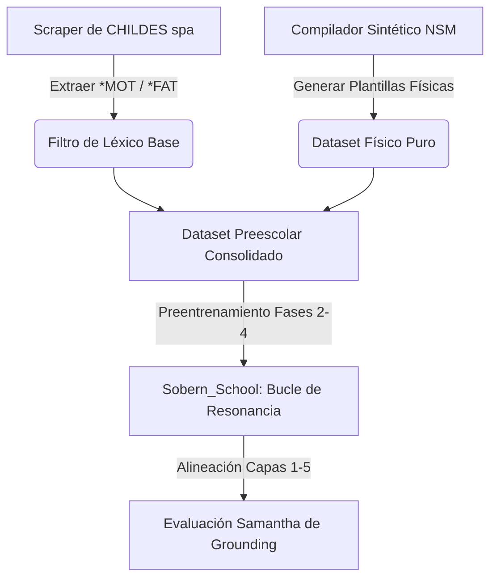

# Hoja de Ruta: Ingesta de CHILDES y Plantillas NSM para el Preentrenamiento de Bit

Este documento detalla el plan estratégico para rediseñar la **Etapa Preescolar** de Bit, sustituyendo el ruido sintáctico de los cuentos infantiles por un corpus estructurado de **Física Semántica y Conductual** basado en la base de datos **CHILDES** y las explicaciones del **Metalenguaje Semántico Natural (NSM)** de Cliff Goddard.

---

## 1. Fundamentos Teóricos de Ingesta

### 1.1 El Ecosistema CHILDES (CHAT Español)
El habla dirigida a niños (*Child-Directed Speech* o *Motherese*) grabada en situaciones de interacción física real proporciona el anclaje perfecto para Bit. Los archivos del corpus CHILDES utilizan el formato **CHAT** (plain text estructurado), que podemos parsear de forma limpia:

```text
@Begin
@Languages: spa
@Participants: CHI Target_Child, MOT Mother
*MOT:	mira esto .
%mor:	v|mira-3S&PRES=look pro:dem|esto=this_one .
*MOT:	quema , duele .
%mor:	v|quema-3S&PRES=burn v|dole-3S&PRES=hurt .
@End
```

**Métricas del Target**: Extraeremos únicamente las líneas del cuidador (`*MOT:`, `*FAT:`, `*INV:`) que utilicen un léxico simplificado y se refieran a interacciones sensorimotoras básicas, ignorando las dependencias sintácticas avanzadas y los tiers dependientes (`%mor:`, `%err:`).

### 1.2 Plantillas Semánticas de Cliff Goddard (NSM)
Cliff Goddard y Anna Wierzbicka demuestran que las definiciones complejas se construyen mediante **plantillas causales** recurrentes usando los 65 primos semánticos. 

Usaremos estas plantillas para construir un **Generador Sintético Combinatorio** que entrene la resonancia latente en oraciones de lógica física pura:

| Concepto Complejo | Plantilla NSM (Física Semántica) |
|---|---|
| **Caer / Gravedad** | `un objeto se mueve hacia abajo -> el objeto toca el suelo -> el objeto no se mueve más -> alguien ve esto y se siente mal` |
| **Peligro / Quemar** | `yo tocar algo -> este algo está caliente -> yo sentir dolor -> esto es malo` |
| **Comer / Nutrición** | `alguien tiene hambre -> alguien pone algo bueno en su boca -> este algo va hacia adentro -> alguien se siente bien` |

---

## 2. Hoja de Ruta de Implementación



### Fase 1: Extracción y Limpieza de CHILDES (`scripts/download_childes_spa.py`)
Crearemos un script automático para:
1. Descargar los corpora de español de la base de datos oficial TalkBank/CHILDES (ej: corpora *Montes*, *Marrero*, *Hess*).
2. Parsear los ficheros `.cha` línea por línea.
3. Filtrar y extraer únicamente las emisiones del adulto dirigidas al niño.
4. Mapear las palabras resultantes al vocabulario de primos de nuestra Capa 1 usando [dictionary_tool.py](file:///home/joan/Documents/IA/frankenswarm/src/bitnet/dictionary_tool.py).

### Fase 2: El Compilador Semántico (`src/bitnet/nsm_physics_breeder.py`)
Implementaremos un generador combinatorio que expanda las ecuaciones de [procedural_breeder.py](file:///home/joan/Documents/IA/frankenswarm/src/bitnet/procedural_breeder.py) a oraciones de sintaxis NSM estricta:
* **Entradas**: Reglas de transición física de la simulación de la arena (ej: si no hay hoguera, la comida se pudre; si Nico se quema, pierde salud y grita).
* **Salida**: Oraciones compuestas por un máximo de 8 palabras primitivas para alimentar la resonancia de las Capas 2 y 4.

### Fase 3: Integración en el Pipeline Escolar (`train_sovereign_school.py`)
* Modificaremos la primera etapa (**preschool**) para que se entrene con un mix del 70% de datos del Compilador Semántico (Física Pura) y 30% del corpus limpio de CHILDES.
* Eliminaremos por completo las frases de cuentos literarios.

### Fase 4: Evaluación de Grounding por Samantha
* Modificaremos `scripts/evaluate_samantha_age.py` para que Samantha evalúe si el agente es capaz de asociar estados corporales y físicos lógicos (ej: si Bit experimenta `miedo` o `dolor`, debe emitir el primo correspondiente y proponer la acción correctora antes de poder graduarse).

---

## 3. Próximos Pasos Inmediatos

1. **[ ]** Crear el descargador y parseador de CHILDES en [scripts/download_childes_spa.py](file:///home/joan/Documents/IA/frankenswarm/scripts/download_childes_spa.py).
2. **[ ]** Desarrollar el generador de física semántica en [src/bitnet/nsm_physics_breeder.py](file:///home/joan/Documents/IA/frankenswarm/src/bitnet/nsm_physics_breeder.py).
3. **[ ]** Adaptar el cargador de datos en [train_sovereign_school.py](file:///home/joan/Documents/IA/frankenswarm/src/bitnet/train_sovereign_school.py) y ejecutar un test piloto de la etapa preescolar.
