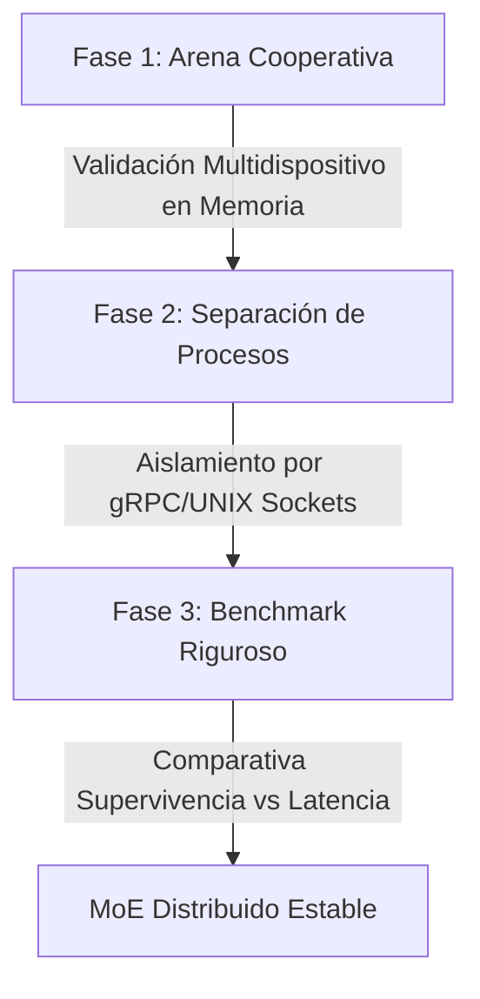

# Plan de Implementación: MoE Distribuido en Arena Cooperativa (Fase 1, 2 y 3)

Este plan establece la ruta de desarrollo para evolucionar el despacho de tensores (*Tensors as API*) en un MoE distribuido real con procesos aislados, cerrando con un benchmark comparativo de supervivencia y rendimiento.

---

## Plan Maestro de Tres Fases



---

## Fase 1: Integración en la Arena Cooperativa (`CooperativeWorld`)
El objetivo es llevar el despacho intra-forward al simulador multi-agente (`CooperativeWorld`), donde los agentes pueden gritar y escucharse, y donde interactúan con el entorno.

### Diseño Técnico:
1. **Modificación del bucle de inferencia**:
   Adaptaremos el bucle de la arena (`train_arena_ppo.py` o `train_arena.py`) para que los agentes A (Nico y Sofy, 256-dim) realicen la pausa y el despacho hacia Bit (Modelo B, 384-dim) en cada paso forward del bucle de simulación.
2. **Coherencia en la Arena**:
   Verificaremos que el flujo de Teoría de la Mente (ToM) y el mapeo de gritos en la arena utilicen correctamente el vocabulario de 15,005 palabras común.

---

## Fase 2: MoE Distribuido Real (Aislamiento de Procesos)
Separaremos físicamente los modelos en procesos independientes para construir el MoE distribuido real.

```
+------------------------------------+          UNIX Socket / TCP          +------------------------------------+
|  Proceso Cliente: Monitos (A)      |  ================================>  |  Proceso Servidor: Bit (B)         |
|  Capa 0-2 (A) -> 15k Probs Tensor  |  <================================  |  Capa 3-4 (B) -> 15k Probs Tensor  |
+------------------------------------+                                     +------------------------------------+
```

### Diseño Técnico:
1. **Servidor Bit (Experto Cognitivo) Concurrente**:
   - Crearemos un script servidor (`scratch/distributed_cognitive_server.py`) que cargue a Bit (`model_milestone_3_years.pt`) y escuche peticiones en un socket UNIX local.
   - **Concurrencia**: El servidor utilizará `asyncio` (`asyncio.start_unix_server`) para manejar de forma concurrente y no bloqueante las conexiones concurrentes de múltiples monitos.
   - Recibirá un tensor de probabilidades sobre el vocabulario (shape `[B, S, 15005]`), ejecutará las capas intermedias 3-4 de Bit, y devolverá un tensor de probabilidades de shape `[B, S, 15005]`.
2. **Protocolo de Transmisión Binaria de Ultra-Baja Latencia**:
   - Para evitar la sobrecarga de serialización JSON/string con tensores grandes (6 * 15,005 floats = ~360 KB), transmitiremos los datos directamente en **binario crudo (float32)** a través del socket.
   - **Formato**:
     - *Header*: 12 bytes conteniendo 3 enteros de 32 bits que representan la forma del tensor (batch, seq, dim).
     - *Payload*: `batch * seq * dim * 4` bytes de datos en flotantes binarios.
3. **Cliente Monito (Tronco Físico)**:
   - Modificaremos el bucle de inferencia para que, en lugar de realizar la multiplicación matricial en memoria, serialice el tensor `probs_a` a binario y lo envíe al socket.
   - Esperará la respuesta síncrona del servidor para re-inyectar el tensor retornado en el Modelo A local.

---

## Fase 3: Benchmark y Métrica Comparativa
Evaluaremos el rendimiento y el comportamiento del monito bajo tres arquitecturas distintas:

1. **Standalone**: Monito A local (256-dim) actuando de forma puramente física sin despacho cognitivo.
2. **Híbrido In-Process**: Monito A despachando a Bit en memoria (menor latencia).
3. **Híbrido Out-of-Process**: Monito A despachando a Bit a través del bus de sockets (MoE distribuido real).

### Métricas a medir:
- **Métricas de Supervivencia**: Ticks de vida promedio, nivel de saciedad (hambre/sed) y tasa de éxito cooperativo (bonos de gritos).
- **Métricas de Rendimiento**: Latencia por tick de simulación (milisegundos) y sobrecarga de serialización del bus de red/sockets.

---

## Proposed Changes

### Component: Frankenswarm Arena & Distributed Core

#### [NEW] [train_arena_unified.py](file:///home/joan/Documents/IA/frankenswarm/scratch/train_arena_unified.py)
Script adaptado de `train_arena.py` que integra el despacho en memoria para dos agentes cooperativos corriendo sobre el vocabulario base unificado de 15,005 palabras.

#### [NEW] [distributed_cognitive_server.py](file:///home/joan/Documents/IA/frankenswarm/scratch/distributed_cognitive_server.py)
Servidor de socket UNIX que hospeda a Bit (Modelo B) para recibir, procesar y retornar tensores semánticos.

#### [NEW] [train_arena_distributed.py](file:///home/joan/Documents/IA/frankenswarm/scratch/train_arena_distributed.py)
Cliente PPO/REINFORCE que realiza llamadas a socket para el forward pass de los agentes.

#### [NEW] [run_comprehensive_benchmark.py](file:///home/joan/Documents/IA/frankenswarm/scratch/run_comprehensive_benchmark.py)
Script automatizado que ejecuta las 3 variantes y genera las métricas comparativas.

---

## Plan de Verificación

1. **Prueba de Arena Híbrida (Fase 1)**:
   ```bash
   PYTHONPATH=. systemd-run --user --scope -p MemoryMax=10G .venv/bin/python scratch/train_arena_unified.py --config configs/experiments/EXP_047_arena_comm.json --episodes 10
   ```
2. **Prueba de Servidor/Cliente Sockets (Fase 2)**:
   Levantar el servidor en segundo plano y correr el cliente para verificar la transmisión del tensor.
3. **Ejecución del Benchmark Completo (Fase 3)**:
   ```bash
   PYTHONPATH=. .venv/bin/python scratch/run_comprehensive_benchmark.py
   ```
